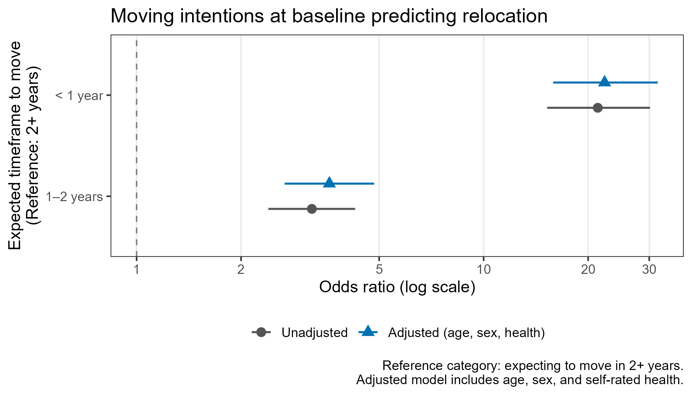
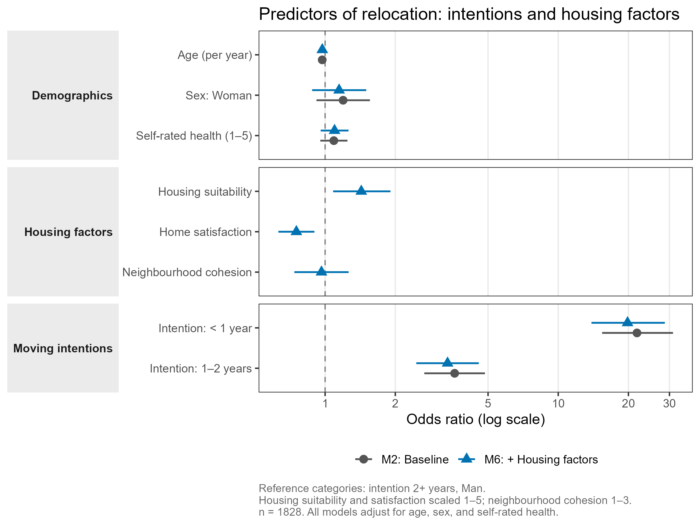
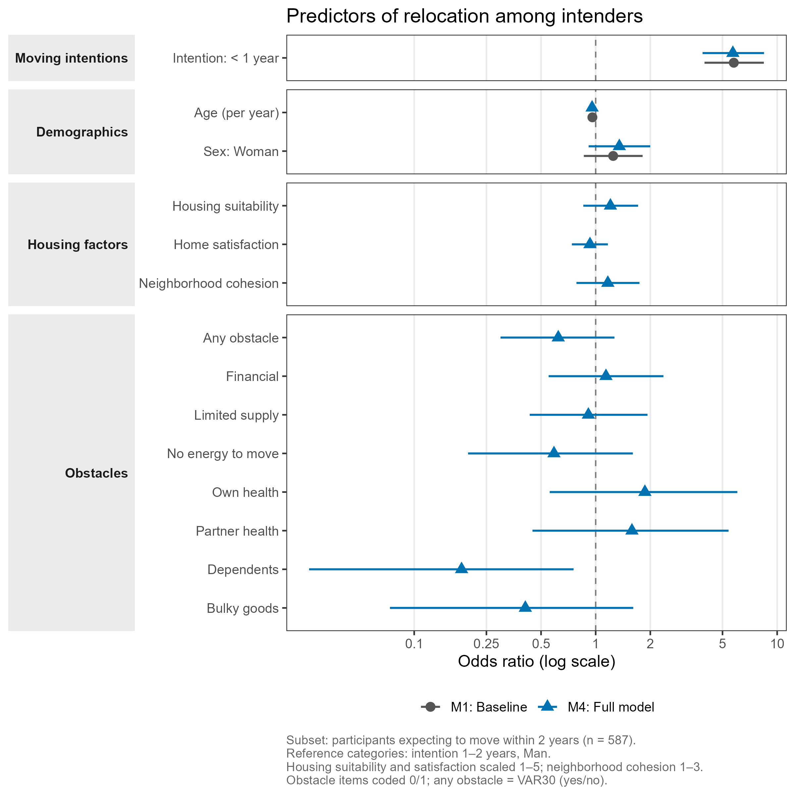

## Background

Population aging, combined with a growing shortage of housing adapted to the needs of older adults, makes understanding residential relocation among older people an increasingly important public health concern. In Sweden, as in many other countries, a significant proportion of older adults are listed on housing company waiting lists, signaling an interest in or need for future relocation. Yet the degree to which such expressed intentions translate into actual moves, and which factors facilitate or hinder that transition, remains poorly understood.

Housing and relocation in later life is shaped by a complex interplay of factors. The decision to move is influenced not only by housing characteristics (usability, tenure, size), but by neighborhood context, social ties, health, and individual capacity. Theory suggests that moving intentions are the most proximal predictor of actual relocation behavior, but there is substantial evidence that a large proportion of older adults who intend to move do not follow through, and conversely that some who do not intend to move relocate unexpectedly. Understanding what explains the gap between intention and action is both theoretically and practically important.

This study draws on a prospective longitudinal project examining housing, relocation, and active and healthy aging among older adults registered on housing company interest lists in Sweden. With data collected across three time points (2021, 2022, 2024), the study is positioned to examine whether and to what extent baseline intentions and housing-related factors predict actual relocation over a three-year period.

## Study aim

The aim of the present study is twofold:

**(a)** To examine whether self-reported moving intentions and housing-related factors at baseline predict actual relocation over a three-year period among older adults listed with an interest in relocation at housing companies.

**(b)** To assess the extent to which intentions translate into realized moves, and among those who intended to move, which factors are associated with not having relocated.

## Research questions

1. To what extent do self-reported moving intentions at baseline predict actual relocation over a three-year period?

2. To what extent do housing-related factors at baseline, particularly home usability, household composition, and neighborhood context, predict actual relocation, independent of moving intentions?

3. Among those who intended to move at baseline, which factors are associated with *not* having relocated after three years?

4. *(If sample size allows)* Among those who did not intend to move at baseline, which factors predict unexpected relocation?

## Design and sample

**Design:** Prospective longitudinal survey study; three time points.

| Wave | Label | Year |
|------|-------|------|
| T1 | Baseline | 2021 |
| T2 | First follow-up | 2022 |
| T3 | Second follow-up | 2024 |

**Population:** Adults aged 55 years or older registered on housing company interest or waiting lists in Sweden.

**Baseline sample (T1):** N = 1,964

The baseline sample was predominantly female (55%), with a mean age of 69 years (SD 7.7, range 54–92). The vast majority (93%) were born in Sweden. Close to two thirds were married or in a registered partnership (63%), with two-person households as the dominant household composition (71%). Most participants were highly educated (67% university), retired (61%), and financially stable (96%). The majority rated their health as good, very good, or excellent (83%), though 26% reported a long-term health condition and 13% reported that it limited their daily activities.

Most participants (82%) owned their home; just over half (53%) lived in multifamily dwellings (apartments or condominiums), with the remainder in single-family houses or townhouses. Housing was predominantly urban (61%) or semi-urban (28%). Overall, home usability was rated highly, and neighborhood and outdoor environment experiences were largely positive.

**Outcome:** Actual relocation between T1 and T3, recorded as binary (`relocated`: 0 = No, 1 = Yes) and as a count (`nr_reloc`).

At baseline, approximately 43% of participants expected to move within two years, with most citing wanting a more suitable or attractive dwelling as their primary reason for being listed with a housing company.

## Longitudinal results (three-year follow-up)

Over the three-year study period, **20.6% of participants (n = 404)** relocated at least once.

### RQ1: Moving intentions predict relocation

Baseline moving intentions were strongly predictive of actual relocation. Compared to those who expected to move in two or more years, the odds of relocation were:

| Intention timeframe | OR (95% CI) | p |
|---------------------|-------------|---|
| 1–2 years | 3.55 (2.65–4.77) | <0.001 |
| < 1 year | 22.1 (15.7–31.3) | <0.001 |

These estimates were virtually unchanged after adjusting for age and sex (Nagelkerke R² = 0.29), indicating that the intention-relocation relationship is not confounded by basic demographics.

Among those who expected to move within a year, **71.4%** actually did so. Among those who expected to wait two or more years, only **10.4%** relocated.

{fig-alt="Forest plot showing odds ratios for intention timeframe categories predicting relocation, unadjusted and adjusted for age and sex." width="75%"}

### RQ2: Housing factors add minimally beyond intentions

Home satisfaction was the only housing factor with an independent association with relocation (OR ≈ 0.76–0.86; lower satisfaction associated with higher odds of relocation). Housing suitability and neighborhood cohesion did not independently predict relocation. Housing factors as a group added only marginally to the model beyond intentions (ΔNagelkerke R² = 0.008).

{fig-alt="Forest plot comparing baseline and full housing models, with predictors grouped by moving intentions, demographics, and housing factors." width="75%"}

### RQ3: Among intenders, who did not relocate?

Of the 609 participants who intended to move within two years, 344 (56%) had not relocated by T3.

Within this subgroup, the most notable findings were:

- **Intention urgency**: Even within intenders, those expecting to move within a year were far more likely to follow through (OR = 5.8 vs. those expecting 1–2 years).
- **Age**: Older intenders were less likely to relocate (OR = 0.96 per year).
- **Having dependents**: The only specific obstacle significantly associated with non-relocation (OR = 0.18, 95% CI: 0.03–0.74), though based on small numbers (n = 19 endorsing this item) and should be interpreted cautiously.
- Housing factors and most other obstacles were not independently associated with non-relocation among intenders.

{fig-alt="Forest plot comparing baseline and full models among intenders, with predictors grouped by moving intentions, demographics, housing factors, and obstacles." width="75%"}

## Project status

| Milestone | Status |
|-----------|--------|
| Data collection (T1) | ✅ Complete |
| Data collection (T2) | ✅ Complete |
| Data collection (T3) | ✅ Complete |
| Data cleaning & translation | ✅ Complete |
| RQ1 Analysis | ✅ Complete |
| RQ2 Analysis | ✅ Complete |
| RQ3 Analysis | ✅ Complete |
| RQ4 Analysis | ⏳ Pending |
| Table 1 | ✅ Complete |
| Forest plots (RQ1, RQ2, RQ3) | ✅ Complete |
| Manuscript drafting | 🔄 In progress |
| Submission | ⏳ Pending |

## Repository and reproducibility

All analysis code is available in the project repository. Scripts are numbered and should be run in order:

| Step | Script | Purpose |
|------|--------|---------|
| 1 | `00_translate_codebook.R` | Translate Swedish labels to English (run once) |
| 2 | `01_import.R` | Import and clean raw data |
| 3 | `02_recode.R` | All variable recodings and composites (documented) |
| 4 | `02_analyze/01–03_RQ*.R` | Logistic regression models per RQ |
| 5 | `03_visualize/00–03_*.R` | Table 1 and forest plots |

## Contact

For questions about this project, please reach out via the project repository.
