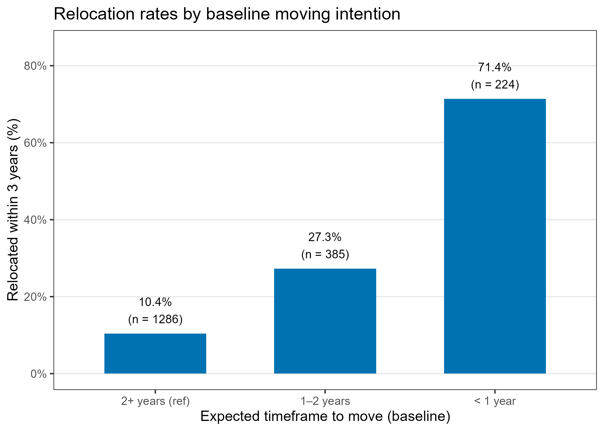
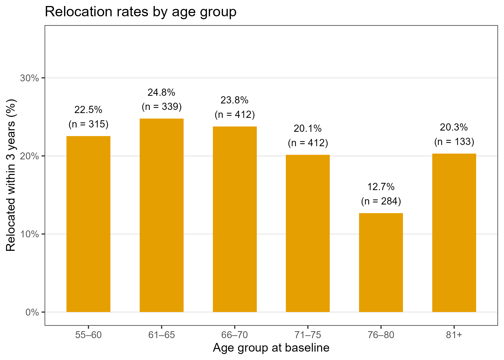
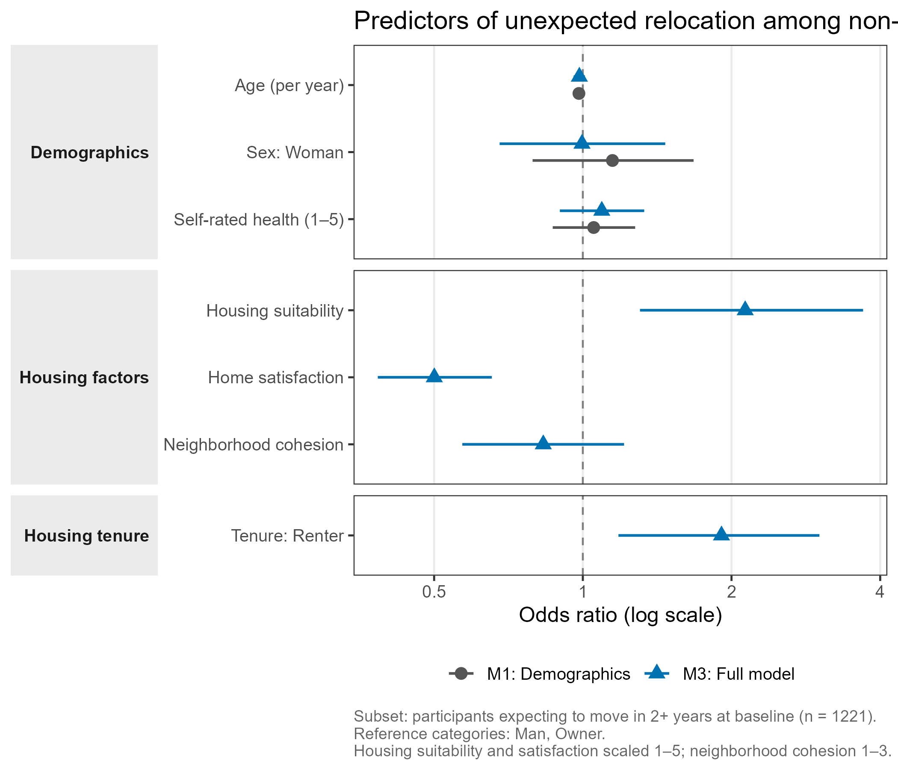
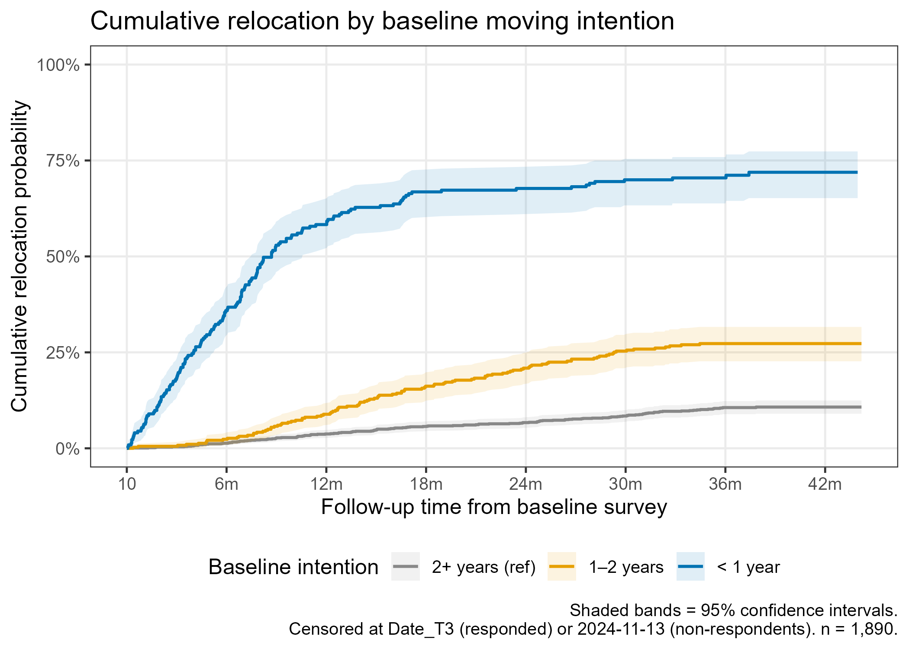
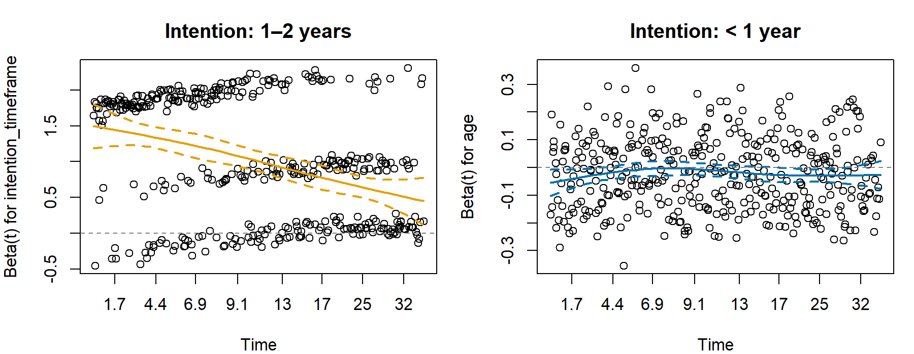
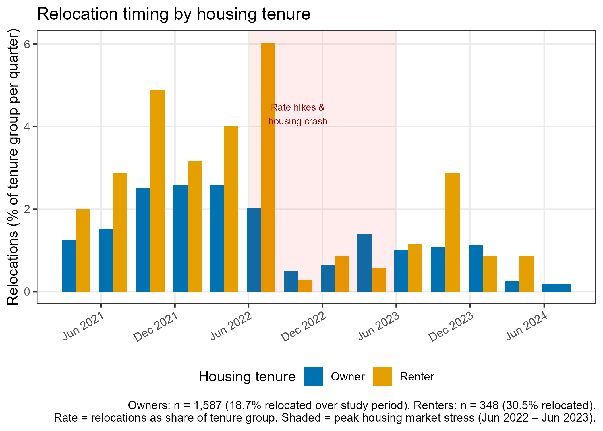

```{r}
#| label: setup
library(tidyverse)
library(broom)
library(gtsummary)

df <- readRDS("../data/processed/survey_analysis.rds")
dat <- df |> filter(!is.na(relocated_f))

# ── RQ1/RQ2 models (full sample) ──────────────────────────────────────────────
dat_rq2 <- dat |>
  filter(
    !is.na(intention_timeframe), !is.na(age), !is.na(sex),
    complete.cases(pick(housing_suitability, home_satisfaction, neighbourhood_cohesion))
  )

m1 <- glm(relocated_f ~ intention_timeframe,
          data = dat_rq2, family = binomial)
m2 <- glm(relocated_f ~ intention_timeframe + age + sex + srh,
          data = dat_rq2, family = binomial)
m6 <- glm(relocated_f ~ intention_timeframe + age + sex + srh +
            housing_suitability + home_satisfaction + neighbourhood_cohesion,
          data = dat_rq2, family = binomial)

# ── RQ3 models (intenders only) ───────────────────────────────────────────────
dat_rq3 <- dat |>
  filter(
    !is.na(intention_level), !is.na(age), !is.na(sex), !is.na(srh),
    complete.cases(pick(
      housing_suitability, home_satisfaction, neighbourhood_cohesion,
      any_obstacle, obs_financial, obs_supply, obs_energy,
      obs_own_health, obs_partner_health, obs_dependents, obs_bulky
    ))
  )

m1_rq3 <- glm(relocated_f ~ intention_level + age + sex + srh,
               data = dat_rq3, family = binomial)
m4_rq3 <- glm(
  relocated_f ~ intention_level + age + sex + srh +
    housing_suitability + home_satisfaction + neighbourhood_cohesion +
    any_obstacle + obs_financial + obs_supply + obs_energy +
    obs_own_health + obs_partner_health + obs_dependents + obs_bulky,
  data = dat_rq3, family = binomial
)
```

## Abstract

**Background:** A large and growing number of older adults in Sweden are registered on housing company interest lists, signaling anticipated relocation needs. Yet the degree to which expressed moving intentions translate into actual moves, and which factors facilitate or obstruct that transition, remains poorly understood.

**Objective:** To examine whether self-reported moving intentions and housing-related factors at baseline predict actual relocation over a three-year period, and to identify factors associated with non-relocation among those who intended to move.

**Methods:** Prospective longitudinal survey study with three time points (T1: 2021, T2: 2022, T3: 2024) among adults aged 55 or older registered on housing company interest lists in Sweden (N = 1,961). Binary logistic regression was used to model the probability of relocation. Models were built sequentially, beginning with moving intentions and demographics (age, sex, self-rated health), then adding housing-related factors (suitability, satisfaction, neighborhood cohesion) and perceived obstacles.

**Results:** Over the three-year period, 20.6% of participants (n = 404) relocated. Baseline moving intentions were the dominant predictor: compared to those expecting to move in two or more years, those expecting to move within one year had over 20-fold higher odds of relocation (OR = 22.1, 95% CI: 15.7–31.3), and 71.4% of this group actually relocated. Home satisfaction was the only housing-related factor independently associated with relocation (OR ≈ 0.76–0.86), though housing factors as a block added minimally beyond intentions (ΔNagelkerke R² = 0.008). Self-rated health was included as a covariate throughout but was not independently associated with relocation in any model (ORs 1.09–1.14, all p > 0.17). Among the 609 intenders, 56% had not relocated by T3. Within this group, stronger intention urgency (OR = 5.8), younger age (OR = 0.96 per year), and having dependents (OR = 0.18) were associated with relocation, while housing factors and most obstacle types were not independently predictive.

**Conclusions:** Moving intentions are the strongest and most consistent predictor of actual relocation among older adults on housing interest lists. Housing dissatisfaction contributes modestly and independently. Among those who intended to move, a majority did not follow through, with older age and having dependents as the most notable barriers. Findings highlight the gap between expressed intention and realized relocation, with implications for housing planning and service provision for older adults.

---

## Background

Population aging, combined with a growing shortage of housing adapted to the needs of older adults, makes understanding residential relocation among older people an increasingly important public health concern. In Sweden, as in many other countries, a significant proportion of older adults are listed on housing company waiting lists, signaling an interest in or need for future relocation. Yet the degree to which such expressed intentions translate into actual moves, and which factors facilitate or hinder that transition, remains poorly understood.

Housing and relocation in later life is shaped by a complex interplay of factors. The decision to move is influenced not only by housing characteristics (usability, tenure, size), but by neighborhood context, social ties, health, and individual capacity. Theory suggests that moving intentions are the most proximal predictor of actual relocation behavior, but there is substantial evidence that a large proportion of older adults who intend to move do not follow through, and conversely that some who do not intend to move relocate unexpectedly. Understanding what explains the gap between intention and action is both theoretically and practically important.

This study draws on a prospective longitudinal project examining housing, relocation, and active and healthy aging among older adults registered on housing company interest lists in Sweden. With data collected across three time points (2021, 2022, 2024), the study is positioned to examine whether and to what extent baseline intentions and housing-related factors predict actual relocation over a three-year period.

## Study aim

The aim of the present study is twofold:

**(a)** To examine whether self-reported moving intentions and housing-related factors at baseline predict actual relocation over a three-year period among older adults listed with an interest in relocation at housing companies.

**(b)** To assess the extent to which intentions translate into realized moves, and among those who intended to move, which factors are associated with not having relocated.

## Research questions

1. To what extent do self-reported moving intentions at baseline predict actual relocation over a three-year period?

2. To what extent do housing-related factors at baseline, particularly home usability, household composition, and neighborhood context, predict actual relocation, independent of moving intentions?

3. Among those who intended to move at baseline, which factors are associated with *not* having relocated after three years?

4. *(If sample size allows)* Among those who did not intend to move at baseline, which factors predict unexpected relocation?

## Design and sample

**Design:** Prospective longitudinal survey study; three time points.

| Wave | Label | Year |
|------|-------|------|
| T1 | Baseline | 2021 |
| T2 | First follow-up | 2022 |
| T3 | Second follow-up | 2024 |

**Population:** Adults aged 55 years or older registered on housing company interest or waiting lists in Sweden.

**Baseline sample (T1):** N = 1,964

The baseline sample was predominantly female (55%), with a mean age of 69 years (SD 7.7, range 54–90). The vast majority (92%) were born in Sweden. Most participants lived with a spouse or partner (68%), with two-person households as the dominant household composition (65%). Most participants were highly educated (67% university), retired (65%), and financially stable (95%). The majority rated their health as good, very good, or excellent (83%), though 25% reported a long-term health condition and 14% reported that it limited their daily activities.

Most participants (81%) owned their home; just over half (53%) lived in multifamily dwellings (apartments or condominiums), with the remainder in single-family houses or townhouses. Overall, home usability was rated highly, and neighborhood and outdoor environment experiences were largely positive.

**Outcome:** Actual relocation between T1 and T3, recorded as binary (`relocated`: 0 = No, 1 = Yes) and as a count (`nr_reloc`).

At baseline, approximately 31% of participants (n = 612) expected to move within two years, with most citing wanting a more suitable or attractive dwelling as their primary reason for being listed with a housing company.

## Descriptive statistics

The table below shows distributions of all analysis variables at baseline, overall and stratified by relocation status. Continuous variables are presented as mean (SD); categorical and binary variables as n (%).

```{r}
#| label: tbl-descriptives
#| tbl-cap: "Baseline characteristics by relocation status"
library(gtsummary)

tab_dat <- dat |>
  mutate(
    srh_f = factor(srh, levels = 1:5,
                   labels = c("1 Poor", "2 Reasonably good",
                              "3 Good", "4 Very good", "5 Excellent")),
    obs_financial_f      = factor(obs_financial,      levels = 0:1, labels = c("No", "Yes")),
    obs_supply_f         = factor(obs_supply,         levels = 0:1, labels = c("No", "Yes")),
    obs_energy_f         = factor(obs_energy,         levels = 0:1, labels = c("No", "Yes")),
    obs_own_health_f     = factor(obs_own_health,     levels = 0:1, labels = c("No", "Yes")),
    obs_partner_health_f = factor(obs_partner_health, levels = 0:1, labels = c("No", "Yes")),
    obs_dependents_f     = factor(obs_dependents,     levels = 0:1, labels = c("No", "Yes")),
    obs_bulky_f          = factor(obs_bulky,          levels = 0:1, labels = c("No", "Yes")),
    any_obstacle_f       = factor(any_obstacle,       levels = 0:1, labels = c("No", "Yes"))
  )

tbl_summary(
  tab_dat,
  by = relocated_f,
  include = c(
    age, sex, srh_f,
    intention_timeframe,
    housing_suitability, home_satisfaction, neighbourhood_cohesion,
    any_obstacle_f,
    obs_financial_f, obs_supply_f, obs_energy_f,
    obs_own_health_f, obs_partner_health_f, obs_dependents_f, obs_bulky_f
  ),
  label = list(
    age                  ~ "Age (years)",
    sex                  ~ "Sex",
    srh_f                ~ "Self-rated health",
    intention_timeframe  ~ "Expected timeframe to move",
    housing_suitability  ~ "Housing suitability (1–5)",
    home_satisfaction    ~ "Home satisfaction (1–5)",
    neighbourhood_cohesion ~ "Neighborhood cohesion (1–3)",
    any_obstacle_f       ~ "Any perceived obstacle",
    obs_financial_f      ~ "  Obstacle: Financial",
    obs_supply_f         ~ "  Obstacle: Limited supply",
    obs_energy_f         ~ "  Obstacle: No energy to move",
    obs_own_health_f     ~ "  Obstacle: Own health",
    obs_partner_health_f ~ "  Obstacle: Partner health",
    obs_dependents_f     ~ "  Obstacle: Dependents",
    obs_bulky_f          ~ "  Obstacle: Bulky goods"
  ),
  statistic = list(
    all_continuous()  ~ "{mean} ({sd})",
    all_categorical() ~ "{n} ({p}%)"
  ),
  digits = list(
    all_continuous()  ~ 1,
    all_categorical() ~ c(0, 1)
  ),
  missing = "no"
) |>
  add_overall(last = FALSE) |>
  add_p(
    test = list(
      all_continuous()  ~ "t.test",
      all_categorical() ~ "chisq.test"
    ),
    pvalue_fun = \(x) style_pvalue(x, digits = 3)
  ) |>
  bold_labels() |>
  bold_p(t = 0.05) |>
  modify_header(
    label    ~ "**Variable**",
    stat_0   ~ "**Overall**\nN = {N}",
    stat_1   ~ "**Not relocated**\nn = {n}",
    stat_2   ~ "**Relocated**\nn = {n}",
    p.value  ~ "**p**"
  ) |>
  modify_footnote(
    stat_0 ~ "Mean (SD) or n (%)",
    p.value ~ "t-test for continuous; chi-squared for categorical"
  )
```

## Longitudinal results (three-year follow-up)

Over the three-year study period, **20.6% of participants (n = 404)** relocated at least once.

### RQ1: Moving intentions predict relocation

Baseline moving intentions were strongly predictive of actual relocation. Compared to those who expected to move in two or more years, the odds of relocation were:

Among those who expected to move within a year, **71.4%** actually did so. Among those who expected to wait two or more years, only **10.4%** relocated.

{fig-alt="Bar chart showing relocation rates by intention timeframe." width="70%"}

**Model equations** (reference category: intention 2+ years; Man):

$$
\begin{aligned}
\text{M1:} \quad \text{logit}(p_i) &= \beta_0 + \beta_1\,\text{Int}_{1\text{–}2\,\text{yr}} + \beta_2\,\text{Int}_{<1\,\text{yr}} \\[6pt]
\text{M2:} \quad \text{logit}(p_i) &= \beta_0 + \beta_1\,\text{Int}_{1\text{–}2\,\text{yr}} + \beta_2\,\text{Int}_{<1\,\text{yr}} + \beta_3\,\text{Age} + \beta_4\,\text{Sex} + \beta_5\,\text{SRH}
\end{aligned}
$$

where $p_i = P(\text{relocated}_i = 1)$, logit$(p) = \log(p / (1-p))$, and SRH = self-rated health (1 = Poor to 5 = Excellent).

```{r}
#| label: tbl-rq1
#| tbl-cap: "RQ1: Logistic regression — moving intentions predicting relocation"
tbl_merge(
  list(
    tbl_regression(m1, exponentiate = TRUE,
                   label = list(intention_timeframe ~ "Intention timeframe")) |>
      modify_header(estimate ~ "**OR**") |>
      bold_p(t = 0.05),
    tbl_regression(m2, exponentiate = TRUE,
                   label = list(intention_timeframe ~ "Intention timeframe",
                                age ~ "Age (per year)",
                                sex ~ "Sex",
                                srh ~ "Self-rated health (1–5)")) |>
      modify_header(estimate ~ "**OR**") |>
      bold_p(t = 0.05)
  ),
  tab_spanner = c("**M1: Unadjusted**", "**M2: Adjusted**")
)
```

{fig-alt="Forest plot showing odds ratios for intention timeframe categories predicting relocation, unadjusted and adjusted for age and sex." width="75%"}

### RQ2: Housing factors add minimally beyond intentions

Home satisfaction was the only housing factor with an independent association with relocation (OR ≈ 0.76–0.86; lower satisfaction associated with higher odds of relocation). Housing suitability and neighborhood cohesion did not independently predict relocation. Housing factors as a group added only marginally to the model beyond intentions (ΔNagelkerke R² = 0.008).

**Model equations** (M2 is carried forward from RQ1; M6 adds housing factors):

$$
\begin{aligned}
\text{M2:} \quad \text{logit}(p_i) &= \beta_0 + \boldsymbol{\beta}_{\text{int}} + \beta_3\,\text{Age} + \beta_4\,\text{Sex} + \beta_5\,\text{SRH} \\[6pt]
\text{M6:} \quad \text{logit}(p_i) &= \beta_0 + \boldsymbol{\beta}_{\text{int}} + \beta_3\,\text{Age} + \beta_4\,\text{Sex} + \beta_5\,\text{SRH} \\
  &\quad + \beta_6\,\text{Suitability} + \beta_7\,\text{Satisfaction} + \beta_8\,\text{Cohesion}
\end{aligned}
$$

```{r}
#| label: tbl-rq2
#| tbl-cap: "RQ2: Logistic regression — housing factors predicting relocation"
tbl_merge(
  list(
    tbl_regression(m2, exponentiate = TRUE,
                   label = list(intention_timeframe ~ "Intention timeframe",
                                age ~ "Age (per year)", sex ~ "Sex",
                                srh ~ "Self-rated health (1–5)")) |>
      modify_header(estimate ~ "**OR**") |>
      bold_p(t = 0.05),
    tbl_regression(m6, exponentiate = TRUE,
                   label = list(intention_timeframe ~ "Intention timeframe",
                                age ~ "Age (per year)", sex ~ "Sex",
                                srh ~ "Self-rated health (1–5)",
                                housing_suitability   ~ "Housing suitability (1–5)",
                                home_satisfaction     ~ "Home satisfaction (1–5)",
                                neighbourhood_cohesion ~ "Neighborhood cohesion (1–3)")) |>
      modify_header(estimate ~ "**OR**") |>
      bold_p(t = 0.05)
  ),
  tab_spanner = c("**M2: Intentions + demographics**",
                  "**M6: + Housing factors**")
)
```

{fig-alt="Forest plot comparing baseline and full housing models, with predictors grouped by moving intentions, demographics, and housing factors." width="75%"}

### RQ3: Among intenders, who did not relocate?

Of the 609 participants who intended to move within two years, 344 (56%) had not relocated by T3.

Within this subgroup, the most notable findings were:

- **Intention urgency**: Even within intenders, those expecting to move within a year were far more likely to follow through (OR = 5.8 vs. those expecting 1–2 years).
- **Age**: Older intenders were less likely to relocate (OR = 0.96 per year).
- **Having dependents**: The only specific obstacle significantly associated with non-relocation (OR = 0.18, 95% CI: 0.03–0.74), though based on small numbers (n = 19 endorsing this item) and should be interpreted cautiously.
- Housing factors and most other obstacles were not independently associated with non-relocation among intenders.

{fig-alt="Bar chart showing relocation rates by age group." width="70%"}

**Model equations** (intender subset only; reference: intention 1–2 years, Man):

$$
\begin{aligned}
\text{M1:} \quad \text{logit}(p_i) &= \beta_0 + \beta_1\,\text{Int}_{<1\,\text{yr}} + \beta_2\,\text{Age} + \beta_3\,\text{Sex} \\[6pt]
\text{M4:} \quad \text{logit}(p_i) &= \beta_0 + \beta_1\,\text{Int}_{<1\,\text{yr}} + \beta_2\,\text{Age} + \beta_3\,\text{Sex} \\
  &\quad + \beta_4\,\text{Suitability} + \beta_5\,\text{Satisfaction} + \beta_6\,\text{Cohesion} \\
  &\quad + \beta_7\,\text{AnyObstacle} + \sum_{k=8}^{14}\beta_k\,\text{Obstacle}_k
\end{aligned}
$$

Obstacle items ($k = 8\ldots14$): financial, limited supply, no energy to move, own health, partner health, dependents, bulky goods.

```{r}
#| label: tbl-rq3
#| tbl-cap: "RQ3: Logistic regression — predictors of relocation among intenders"
tbl_merge(
  list(
    tbl_regression(m1_rq3, exponentiate = TRUE,
                   label = list(intention_level ~ "Intention (< 1 yr vs 1–2 yrs)",
                                age ~ "Age (per year)", sex ~ "Sex")) |>
      modify_header(estimate ~ "**OR**") |>
      bold_p(t = 0.05),
    tbl_regression(m4_rq3, exponentiate = TRUE,
                   label = list(intention_level ~ "Intention (< 1 yr vs 1–2 yrs)",
                                age ~ "Age (per year)", sex ~ "Sex",
                                housing_suitability    ~ "Housing suitability (1–5)",
                                home_satisfaction      ~ "Home satisfaction (1–5)",
                                neighbourhood_cohesion ~ "Neighborhood cohesion (1–3)",
                                any_obstacle           ~ "Any obstacle",
                                obs_financial          ~ "Obstacle: Financial",
                                obs_supply             ~ "Obstacle: Limited supply",
                                obs_energy             ~ "Obstacle: No energy to move",
                                obs_own_health         ~ "Obstacle: Own health",
                                obs_partner_health     ~ "Obstacle: Partner health",
                                obs_dependents         ~ "Obstacle: Dependents",
                                obs_bulky              ~ "Obstacle: Bulky goods")) |>
      modify_header(estimate ~ "**OR**") |>
      bold_p(t = 0.05)
  ),
  tab_spanner = c("**M1: Baseline**", "**M4: Full model**")
)
```

{fig-alt="Forest plot comparing baseline and full models among intenders, with predictors grouped by moving intentions, demographics, housing factors, and obstacles." width="75%"}

### RQ4: Among non-intenders, what predicts unexpected relocation?

Of the 1,286 participants who did not expect to move within two years at baseline, 134 (10.4%) had relocated by T3. Among this group — unexpected movers — the predictors of relocation differed markedly from the full-sample analyses.

Demographics (age, sex, self-rated health) were not associated with unexpected relocation in any model. Housing-related factors, by contrast, were strongly predictive:

- **Home satisfaction** was the dominant predictor (OR = 0.50, 95% CI: 0.38–0.65, p < 0.001). The effect is notably stronger than in the full-sample model (OR ≈ 0.76–0.86 in RQ2), suggesting that housing dissatisfaction is a particularly potent trigger for reactive, unplanned moves.
- **Housing tenure**: renters were nearly twice as likely to relocate unexpectedly as owners (OR = 1.91, 95% CI: 1.18–3.01, p = 0.007), consistent with involuntary displacement (e.g., lease termination, rent increases).
- **Housing suitability** showed a positive association in the same direction as the suppression effect observed in RQ2 (OR ≈ 1.95–2.13, p < 0.05); this likely reflects collinearity with home satisfaction rather than a causal effect.
- Neighborhood cohesion was not independently associated with unexpected relocation.

Housing factors as a block added meaningfully to the model beyond demographics (LRT p < 0.001; ΔNagelkerke R² = 0.043), while demographics alone explained negligible variance (Nagelkerke R² = 0.006).

```{r}
#| label: tbl-rq4
#| tbl-cap: "RQ4: Logistic regression — predictors of unexpected relocation among non-intenders"
dat_rq4 <- dat |>
  filter(as.numeric(VAR24_T1) == 3) |>
  mutate(
    owner = factor(
      case_when(
        as.numeric(VAR01_2_T1) == 1 ~ "Owner",
        as.numeric(VAR01_2_T1) == 2 ~ "Renter",
        TRUE ~ NA_character_
      ),
      levels = c("Owner", "Renter")
    )
  ) |>
  filter(
    !is.na(age), !is.na(sex), !is.na(srh),
    complete.cases(pick(housing_suitability, home_satisfaction,
                        neighbourhood_cohesion)),
    !is.na(owner)
  )

m1_rq4 <- glm(relocated_f ~ age + sex + srh,
               data = dat_rq4, family = binomial)
m3_rq4 <- glm(relocated_f ~ age + sex + srh +
                 housing_suitability + home_satisfaction +
                 neighbourhood_cohesion + owner,
               data = dat_rq4, family = binomial)

tbl_merge(
  list(
    tbl_regression(m1_rq4, exponentiate = TRUE,
                   label = list(age ~ "Age (per year)", sex ~ "Sex",
                                srh ~ "Self-rated health (1–5)")) |>
      modify_header(estimate ~ "**OR**") |>
      bold_p(t = 0.05),
    tbl_regression(m3_rq4, exponentiate = TRUE,
                   label = list(age ~ "Age (per year)", sex ~ "Sex",
                                srh ~ "Self-rated health (1–5)",
                                housing_suitability    ~ "Housing suitability (1–5)",
                                home_satisfaction      ~ "Home satisfaction (1–5)",
                                neighbourhood_cohesion ~ "Neighborhood cohesion (1–3)",
                                owner                  ~ "Tenure")) |>
      modify_header(estimate ~ "**OR**") |>
      bold_p(t = 0.05)
  ),
  tab_spanner = c("**M1: Demographics**", "**M3: Full model**")
)
```

{fig-alt="Forest plot showing odds ratios for predictors of unexpected relocation among non-intenders, comparing demographics-only and full models." width="75%"}

## Further analysis: Survival analysis

To complement the logistic regression results, a Cox proportional hazards model was fitted using exact relocation dates rather than the binary endpoint. This approach accounts for (a) the varying length of follow-up across participants (T1 surveys were completed between March and December 2021) and (b) right-censoring of participants who had not relocated by T3.

**Censoring rules:** Participants who relocated were assigned their exact relocation date. Non-relocators who responded at T3 were censored at their T3 survey date. Non-relocators who did not respond at T3 (n = 545) were administratively censored at the last T3 survey date (2024-11-13). Results should be interpreted with this caveat, as non-response may not be independent of relocation or health status.

```{r}
#| label: surv-setup
study_end <- as.Date("2024-11-13")

surv_dat <- dat |>
  filter(!is.na(Date_T1), !is.na(intention_timeframe),
         !is.na(age), !is.na(sex), !is.na(srh)) |>
  mutate(
    end_date    = case_when(
      relocated == 1  ~ reloc_date1,
      !is.na(Date_T3) ~ Date_T3,
      TRUE            ~ study_end
    ),
    time_months = as.numeric(end_date - Date_T1) / 30.44,
    event       = as.integer(relocated == 1)
  ) |>
  filter(time_months > 0)

surv_dat_m3 <- surv_dat |>
  filter(complete.cases(pick(housing_suitability, home_satisfaction,
                             neighbourhood_cohesion)))

cox_m1 <- survival::coxph(
  survival::Surv(time_months, event) ~ intention_timeframe,
  data = surv_dat)

cox_m2 <- survival::coxph(
  survival::Surv(time_months, event) ~ intention_timeframe + age + sex + srh,
  data = surv_dat)

cox_strat <- survival::coxph(
  survival::Surv(time_months, event) ~ survival::strata(intention_timeframe) +
    age + sex + srh + housing_suitability + home_satisfaction + neighbourhood_cohesion,
  data = surv_dat_m3)
```

### Cumulative incidence by intention group

The figure below shows the cumulative probability of relocation over follow-up time, stratified by baseline intention group. The strong early rise in the `< 1 year` group reflects rapid follow-through among those with urgent intentions; the curve then plateaus after approximately 18 months as the remaining non-movers in this group converge toward the rate of the other groups.

{fig-alt="Kaplan-Meier cumulative incidence curves by intention group." width="75%"}

### Cox proportional hazards models

```{r}
#| label: tbl-cox
#| tbl-cap: "Cox proportional hazards models for time to relocation"
tbl_merge(
  list(
    tbl_regression(cox_m1, exponentiate = TRUE,
                   label = list(intention_timeframe ~ "Intention timeframe")) |>
      modify_header(estimate ~ "**HR**") |>
      bold_p(t = 0.05),
    tbl_regression(cox_m2, exponentiate = TRUE,
                   label = list(intention_timeframe ~ "Intention timeframe",
                                age ~ "Age (per year)", sex ~ "Sex",
                                srh ~ "Self-rated health (1–5)")) |>
      modify_header(estimate ~ "**HR**") |>
      bold_p(t = 0.05)
  ),
  tab_spanner = c("**Cox M1: Unadjusted**", "**Cox M2: Adjusted**")
)
```

### Proportional hazards assumption

```{r}
#| label: tbl-ph
#| tbl-cap: "Schoenfeld residuals test of proportional hazards (Cox M2)"
ph <- survival::cox.zph(cox_m2)
tibble::tibble(
  Term  = c("Intention timeframe", "Age", "Sex", "Self-rated health", "Global test"),
  `χ²`  = round(ph$table[, "chisq"], 3),
  df    = ph$table[, "df"],
  p     = round(ph$table[, "p"], 4)
) |>
  gt::gt() |>
  gt::tab_style(
    style     = gt::cell_text(weight = "bold"),
    locations = gt::cells_body(rows = p < 0.05)
  )
```

The proportional hazards assumption is **violated for intention timeframe** (p < 0.001), consistent with the KM curves: the hazard of relocation in the `< 1 year` group is very high early in follow-up but attenuates over time as the early movers are exhausted. All other predictors satisfy the PH assumption.

The Schoenfeld residual plots below illustrate this pattern:

{fig-alt="Schoenfeld residual plots showing time-varying coefficients for intention 1-2 years and < 1 year." width="80%"}

### Stratified Cox model

To obtain valid covariate estimates unaffected by the PH violation, a stratified Cox model was fitted with intention timeframe as the stratifying variable. This removes the HR for intention (shown by the KM curves instead) but ensures unbiased estimates for age, sex, health, and housing factors.

```{r}
#| label: tbl-cox-strat
#| tbl-cap: "Stratified Cox model (stratified by intention timeframe)"
tbl_regression(cox_strat, exponentiate = TRUE,
               label = list(age ~ "Age (per year)", sex ~ "Sex",
                            srh ~ "Self-rated health (1–5)",
                            housing_suitability    ~ "Housing suitability (1–5)",
                            home_satisfaction      ~ "Home satisfaction (1–5)",
                            neighbourhood_cohesion ~ "Neighborhood cohesion (1–3)")) |>
  modify_header(estimate ~ "**HR**") |>
  bold_p(t = 0.05) |>
  modify_caption("Stratified Cox model: HRs for covariates, stratified by intention timeframe.
                  Reference: Man. n = 1,828.")
```

Results from the stratified Cox model are consistent with logistic regression: lower home satisfaction is associated with a higher hazard of relocation (HR = 0.84, p = 0.005), while housing suitability shows a positive association in the same direction as the suppression effect noted in RQ2. Neighborhood cohesion, sex, and self-rated health were not independently associated with time to relocation.

### Macro-economic context: Rate hikes and the Swedish housing market

The study period (2021–2024) coincided with two major macro-economic shocks that are directly relevant to relocation behavior among older homeowners.

**Swedish interest rate trajectory (Riksbank)**

Sweden's central bank held the benchmark rate at 0% from late 2019 through early 2022. Beginning in April 2022, the Riksbank initiated an aggressive tightening cycle in response to surging inflation:

| Date | Riksbank rate |
|------|--------------|
| April 2022 | 0.25% |
| September 2022 | 1.75% |
| February 2023 | 3.00% |
| May 2023 | 3.50% |
| September 2023 | 4.00% (peak) |
| November 2024 | 2.75% (declining) |

This rapid increase in borrowing costs — from 0% to 4% in approximately 18 months — directly affected both housing affordability and transaction volumes.

**Swedish housing price collapse**

Swedish residential property prices peaked in early 2022 and declined sharply thereafter. According to Statistics Sweden (SCB) and Valueguard, single-family home prices fell approximately 20% from peak (Q1 2022) to trough (Q4 2022 – Q1 2023), with condominium prices falling a similar amount. This represented one of the sharpest housing market corrections in Europe during that period. Prices began recovering gradually through 2024 as the Riksbank reversed course.

The practical consequence for older homeowners intending to move: selling an owned property during 2022–2023 meant either crystallizing a significant capital loss or waiting for recovery — a decision that effectively locked many intenders in place regardless of their stated moving intentions.

**Relocation timing by tenure**

The figure below shows quarterly relocation rates (as a share of each tenure group) across the study period, split by homeownership status. Both groups decline during the highlighted stress period, but the pattern differs: owner-occupied relocations show a sustained multi-quarter suppression from mid-2022, consistent with sellers waiting out the downturn; renters show more volatile quarter-to-quarter rates, with an apparent spike in Q3 2022 that may reflect inflation-driven displacement (rising rents forcing involuntary moves) followed by a sharp drop as rental affordability deteriorated.

It bears noting that the renter group is substantially smaller (n = 348) than the owner group (n = 1,587), so individual quarterly bars for renters represent small absolute numbers and should be interpreted cautiously.

{fig-alt="Bar chart showing quarterly relocation rates by owner vs renter status, with shaded period indicating housing market stress." width="80%"}

These patterns are descriptive and cannot be formally tested within the current study design — the survey has no time-varying measures of housing market perceptions or financial capacity. They are presented to contextualise the intention-action gap identified in the main analyses: a proportion of the non-relocating intenders were likely constrained by structural market conditions rather than the personal barriers measured at baseline.

## Project status

| Milestone | Status |
|-----------|--------|
| Data collection (T1) | ✅ Complete |
| Data collection (T2) | ✅ Complete |
| Data collection (T3) | ✅ Complete |
| Data cleaning & translation | ✅ Complete |
| RQ1 Analysis | ✅ Complete |
| RQ2 Analysis | ✅ Complete |
| RQ3 Analysis | ✅ Complete |
| RQ4 Analysis | ⏳ Pending |
| Table 1 | ✅ Complete |
| Forest plots (RQ1, RQ2, RQ3) | ✅ Complete |
| Manuscript drafting | 🔄 In progress |
| Submission | ⏳ Pending |

## Repository and reproducibility

All analysis code is available in the project repository. Scripts are numbered and should be run in order:

| Step | Script | Purpose |
|------|--------|---------|
| 1 | `00_translate_codebook.R` | Translate Swedish labels to English (run once) |
| 2 | `01_import.R` | Import and clean raw data |
| 3 | `02_recode.R` | All variable recodings and composites (documented) |
| 4 | `02_analyze/01–03_RQ*.R` | Logistic regression models per RQ |
| 5 | `03_visualize/00–03_*.R` | Table 1 and forest plots |

## Contact

For questions about this project, please reach out via the project repository.
