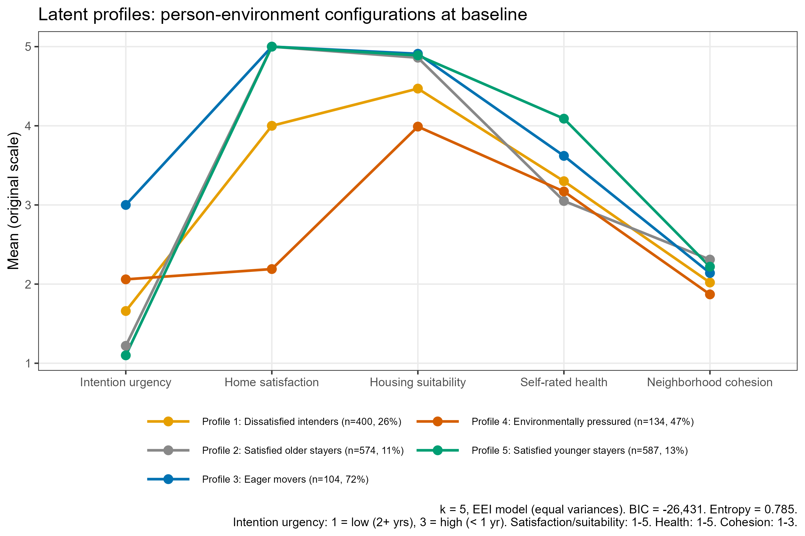

```{r}
#| label: setup
library(tidyverse)
library(haven)
library(broom)
library(gtsummary)
library(gt)

df  <- readRDS("../data/processed/survey_analysis.rds")
dat <- df |> filter(!is.na(relocated_f))

# ── RQ1/RQ2 models — full sample ──────────────────────────────────────────────
dat_rq2 <- dat |>
  filter(
    !is.na(intention_timeframe), !is.na(age), !is.na(sex),
    complete.cases(pick(housing_suitability, home_satisfaction,
                        neighbourhood_cohesion))
  )

m1 <- glm(relocated_f ~ intention_timeframe,
          data = dat_rq2, family = binomial)
m2 <- glm(relocated_f ~ intention_timeframe + age + sex + srh,
          data = dat_rq2, family = binomial)
m6 <- glm(relocated_f ~ intention_timeframe + age + sex + srh +
            housing_suitability + home_satisfaction + neighbourhood_cohesion,
          data = dat_rq2, family = binomial)

# ── RQ3 models — intenders only ───────────────────────────────────────────────
dat_rq3 <- dat |>
  filter(
    !is.na(intention_level), !is.na(age), !is.na(sex), !is.na(srh),
    complete.cases(pick(
      housing_suitability, home_satisfaction, neighbourhood_cohesion,
      any_obstacle, obs_financial, obs_supply, obs_energy,
      obs_own_health, obs_partner_health, obs_dependents, obs_bulky
    ))
  )

m1_rq3 <- glm(relocated_f ~ intention_level + age + sex + srh,
               data = dat_rq3, family = binomial)
m4_rq3 <- glm(
  relocated_f ~ intention_level + age + sex + srh +
    housing_suitability + home_satisfaction + neighbourhood_cohesion +
    any_obstacle + obs_financial + obs_supply + obs_energy +
    obs_own_health + obs_partner_health + obs_dependents + obs_bulky,
  data = dat_rq3, family = binomial
)

# ── RQ4 models — non-intenders only ───────────────────────────────────────────
dat_rq4 <- dat |>
  filter(as.numeric(VAR24_T1) == 3) |>
  mutate(
    owner = factor(
      case_when(
        as.numeric(VAR01_2_T1) == 1 ~ "Owner",
        as.numeric(VAR01_2_T1) == 2 ~ "Renter",
        TRUE ~ NA_character_
      ),
      levels = c("Owner", "Renter")
    )
  ) |>
  filter(
    !is.na(age), !is.na(sex), !is.na(srh),
    complete.cases(pick(housing_suitability, home_satisfaction,
                        neighbourhood_cohesion)),
    !is.na(owner)
  )

m1_rq4 <- glm(relocated_f ~ age + sex + srh,
               data = dat_rq4, family = binomial)
m3_rq4 <- glm(relocated_f ~ age + sex + srh +
                 housing_suitability + home_satisfaction +
                 neighbourhood_cohesion + owner,
               data = dat_rq4, family = binomial)

# ── Survival setup ─────────────────────────────────────────────────────────────
# reloc_date1 is sourced from the Swedish tax register (folkbokföring) and
# reflects the precise registered address-change date — not self-reported.
study_end <- as.Date("2024-11-13")

surv_dat <- dat |>
  filter(!is.na(Date_T1), !is.na(intention_timeframe),
         !is.na(age), !is.na(sex), !is.na(srh)) |>
  mutate(
    end_date    = case_when(
      relocated == 1  ~ reloc_date1,
      !is.na(Date_T3) ~ Date_T3,
      TRUE            ~ study_end
    ),
    time_months = as.numeric(end_date - Date_T1) / 30.44,
    event       = as.integer(relocated == 1)
  ) |>
  filter(time_months > 0)

surv_dat_m3 <- surv_dat |>
  filter(complete.cases(pick(housing_suitability, home_satisfaction,
                             neighbourhood_cohesion)))

cox_m1 <- survival::coxph(
  survival::Surv(time_months, event) ~ intention_timeframe,
  data = surv_dat)

cox_m2 <- survival::coxph(
  survival::Surv(time_months, event) ~ intention_timeframe + age + sex + srh,
  data = surv_dat)

cox_strat <- survival::coxph(
  survival::Surv(time_months, event) ~
    survival::strata(intention_timeframe) +
    age + sex + srh +
    housing_suitability + home_satisfaction + neighbourhood_cohesion,
  data = surv_dat_m3)
```

---

::: {.callout-note appearance="minimal"}
**About this document**

This page presents two linked papers from a prospective longitudinal study of residential relocation among older adults registered on housing company interest lists in Sweden (N = 1,961; T1: 2021, T2: 2022, T3: 2024). Exact relocation dates are sourced from the Swedish tax register (folkbokföring). Register linkage for additional predictors (income, housing characteristics) is planned; see [Planned future analyses](#planned-future-analyses).

**Paper 1** examines how strongly moving intentions predict realized relocation and why many intenders do not follow through.  
**Paper 2** examines who relocates without intending to, and identifies the housing and structural factors that drive reactive, unplanned moves.

Jump to: [Paper 1](#paper-1) · [Paper 2](#paper-2) · [Appendix: Full LPA](#appendix-full-latent-profile-analysis)
:::

---

# Shared methods {#shared-methods}

## Study design and sample

**Design:** Prospective longitudinal survey study; three time points.

| Wave | Label | Year |
|------|-------|------|
| T1 | Baseline | 2021 |
| T2 | First follow-up | 2022 |
| T3 | Second follow-up | 2024 |

**Population:** Adults aged 55 years or older registered on housing company interest or waiting lists in Sweden.

**Baseline sample (T1):** N = 1,964. The sample was predominantly female (55%), with a mean age of 69 years (SD 7.7, range 54–90). The vast majority (92%) were born in Sweden. Most participants lived with a spouse or partner (68%). Most were highly educated (67% university), retired (65%), and financially stable (95%). The majority rated their health as good, very good, or excellent (83%), though 25% reported a long-term health condition. Most participants (81%) owned their home; just over half (53%) lived in multifamily dwellings.

**Outcome:** Actual relocation between T1 and T3, recorded as binary (`relocated`: 0 = No, 1 = Yes). For survival analyses, exact move dates are taken from the Swedish tax register (folkbokföring), which records registered address changes precisely and are therefore not subject to recall bias. At baseline, approximately 31% of participants (n = 612) expected to move within two years.

## Descriptive statistics {#descriptive-statistics}

```{r}
#| label: tbl-descriptives
#| tbl-cap: "Table 1: Baseline characteristics by relocation status"

tab_dat <- dat |>
  mutate(
    srh_f = factor(srh, levels = 1:5,
                   labels = c("1 Poor", "2 Reasonably good",
                              "3 Good", "4 Very good", "5 Excellent")),
    obs_financial_f      = factor(obs_financial,      levels = 0:1, labels = c("No", "Yes")),
    obs_supply_f         = factor(obs_supply,         levels = 0:1, labels = c("No", "Yes")),
    obs_energy_f         = factor(obs_energy,         levels = 0:1, labels = c("No", "Yes")),
    obs_own_health_f     = factor(obs_own_health,     levels = 0:1, labels = c("No", "Yes")),
    obs_partner_health_f = factor(obs_partner_health, levels = 0:1, labels = c("No", "Yes")),
    obs_dependents_f     = factor(obs_dependents,     levels = 0:1, labels = c("No", "Yes")),
    obs_bulky_f          = factor(obs_bulky,          levels = 0:1, labels = c("No", "Yes")),
    any_obstacle_f       = factor(any_obstacle,       levels = 0:1, labels = c("No", "Yes"))
  )

tbl_summary(
  tab_dat,
  by = relocated_f,
  include = c(
    age, sex, srh_f,
    intention_timeframe,
    housing_suitability, home_satisfaction, neighbourhood_cohesion,
    any_obstacle_f,
    obs_financial_f, obs_supply_f, obs_energy_f,
    obs_own_health_f, obs_partner_health_f, obs_dependents_f, obs_bulky_f
  ),
  label = list(
    age                    ~ "Age (years)",
    sex                    ~ "Sex",
    srh_f                  ~ "Self-rated health",
    intention_timeframe    ~ "Expected timeframe to move",
    housing_suitability    ~ "Housing suitability (1–5)",
    home_satisfaction      ~ "Home satisfaction (1–5)",
    neighbourhood_cohesion ~ "Neighborhood cohesion (1–3)",
    any_obstacle_f         ~ "Any perceived obstacle",
    obs_financial_f        ~ "  Obstacle: Financial",
    obs_supply_f           ~ "  Obstacle: Limited supply",
    obs_energy_f           ~ "  Obstacle: No energy to move",
    obs_own_health_f       ~ "  Obstacle: Own health",
    obs_partner_health_f   ~ "  Obstacle: Partner health",
    obs_dependents_f       ~ "  Obstacle: Dependents",
    obs_bulky_f            ~ "  Obstacle: Bulky goods"
  ),
  statistic = list(
    all_continuous()  ~ "{mean} ({sd})",
    all_categorical() ~ "{n} ({p}%)"
  ),
  digits = list(
    all_continuous()  ~ 1,
    all_categorical() ~ c(0, 1)
  ),
  missing = "no"
) |>
  add_overall(last = FALSE) |>
  add_p(
    test = list(
      all_continuous()  ~ "t.test",
      all_categorical() ~ "chisq.test"
    ),
    pvalue_fun = \(x) style_pvalue(x, digits = 3)
  ) |>
  bold_labels() |>
  bold_p(t = 0.05) |>
  modify_header(
    label    ~ "**Variable**",
    stat_0   ~ "**Overall**\nN = {N}",
    stat_1   ~ "**Not relocated**\nn = {n}",
    stat_2   ~ "**Relocated**\nn = {n}",
    p.value  ~ "**p**"
  ) |>
  modify_footnote(
    stat_0  ~ "Mean (SD) or n (%)",
    p.value ~ "t-test for continuous; chi-squared for categorical"
  )
```

---

# Paper 1: The intention–behavior gap in later-life relocation {#paper-1}

::: {.callout-note appearance="minimal"}
**Paper 1 scope:** Full-sample prediction analyses (RQ1–RQ3). Survival analysis uses exact move dates from the Swedish tax register. Predictors of unexpected relocation among non-intenders are examined in [Paper 2](#paper-2).
:::

## Abstract {#p1-abstract}

**Background:** A large and growing number of older adults in Sweden are registered on housing company interest lists, signaling anticipated relocation needs. Yet the degree to which expressed moving intentions translate into actual moves, and which factors facilitate or obstruct that transition, remains poorly understood.

**Objective:** To examine whether self-reported moving intentions and housing-related factors at baseline predict actual relocation over a three-year period, and to identify factors associated with non-relocation among those who intended to move.

**Methods:** Prospective longitudinal survey study with three time points (T1: 2021, T2: 2022, T3: 2024) among adults aged 55 or older registered on housing company interest lists in Sweden (N = 1,961). Binary logistic regression was used to model the probability of relocation, with models built sequentially from intentions and demographics through housing factors and perceived obstacles. Cox proportional hazards models used exact move dates from the Swedish tax register to account for varying follow-up length; a stratified model addressed a proportional hazards violation for intention timeframe. A supplementary latent profile analysis is reported in the appendix.

**Results:** Over the three-year period, 20.6% of participants (n = 404) relocated. Baseline moving intentions were the dominant predictor: compared to those expecting to move in two or more years, those expecting to move within one year had over 20-fold higher odds of relocation (OR = 22.1, 95% CI: 15.7–31.3), and 71.4% of this group actually relocated. Home satisfaction was the only housing-related factor independently associated with relocation in the full sample (OR ≈ 0.76–0.86), though housing factors as a block added minimally beyond intentions (ΔNagelkerke R² = 0.008). Among the 609 intenders, 56% had not relocated by T3; within this group, stronger intention urgency (OR = 5.8), younger age (OR = 0.96 per year), and having dependents (OR = 0.18) were associated with relocation, while housing factors and most specific obstacles were not.

**Conclusions:** Moving intentions are the strongest predictor of relocation, but 56% of intenders did not move within three years. Among blocked intenders, the gap was explained by intention urgency, age, and life-course factors rather than housing conditions, suggesting structural and market-level constraints as the primary barrier. Predictors of unexpected relocation among non-intenders are examined in a companion paper.

## Background {#p1-background}

Population aging, combined with a growing shortage of housing adapted to the needs of older adults, makes understanding residential relocation among older people an increasingly important public health concern. In Sweden, as in many other countries, a significant proportion of older adults are listed on housing company waiting lists, signaling an interest in or need for future relocation. Yet the degree to which such expressed intentions translate into actual moves, and which factors facilitate or hinder that transition, remains poorly understood.

Housing and relocation in later life is shaped by a complex interplay of factors. The decision to move is influenced not only by housing characteristics (usability, tenure, size), but by neighborhood context, social ties, health, and individual capacity. Theory suggests that moving intentions are the most proximal predictor of actual relocation behavior, but there is substantial evidence that a large proportion of older adults who intend to move do not follow through, and conversely that some who do not intend to move relocate unexpectedly.

This study draws on a prospective longitudinal project examining housing, relocation, and active and healthy aging among older adults registered on housing company interest lists in Sweden. Predictors of unexpected relocation among non-intenders are examined in [Paper 2](#paper-2).

## Study aim and research questions {#p1-aims}

The aim of Paper 1 is twofold:

**(a)** To examine whether self-reported moving intentions and housing-related factors at baseline predict actual relocation over a three-year period among older adults listed with an interest in relocation at housing companies.

**(b)** To assess the extent to which intentions translate into realized moves, and among those who intended to move, which factors are associated with not having relocated.

**Research questions:**

1. To what extent do self-reported moving intentions at baseline predict actual relocation over a three-year period?
2. To what extent do housing-related factors at baseline predict actual relocation, independent of moving intentions?
3. Among those who intended to move at baseline, which factors are associated with *not* having relocated after three years?

*Predictors of unexpected relocation among non-intenders (RQ4) are addressed in [Paper 2](#paper-2).*

## Results {#p1-results}

Over the three-year study period, **20.6% of participants (n = 404)** relocated at least once.

### RQ1: Moving intentions predict relocation {#rq1}

Baseline moving intentions were strongly predictive of actual relocation. Among those who expected to move within a year, **71.4%** actually did so; among those expecting to wait two or more years, only **10.4%** relocated.

{fig-alt="Bar chart showing relocation rates by intention timeframe." width="70%"}

**Model equations** (reference: intention 2+ years; Man):

$$
\begin{aligned}
\text{M1:} \quad \text{logit}(p_i) &= \beta_0 + \beta_1\,\text{Int}_{1\text{–}2\,\text{yr}} + \beta_2\,\text{Int}_{<1\,\text{yr}} \\[6pt]
\text{M2:} \quad \text{logit}(p_i) &= \beta_0 + \beta_1\,\text{Int}_{1\text{–}2\,\text{yr}} + \beta_2\,\text{Int}_{<1\,\text{yr}} + \beta_3\,\text{Age} + \beta_4\,\text{Sex} + \beta_5\,\text{SRH}
\end{aligned}
$$

```{r}
#| label: tbl-rq1
#| tbl-cap: "RQ1: Logistic regression — moving intentions predicting relocation"
tbl_merge(
  list(
    tbl_regression(m1, exponentiate = TRUE,
                   label = list(intention_timeframe ~ "Intention timeframe")) |>
      modify_header(estimate ~ "**OR**") |>
      bold_p(t = 0.05),
    tbl_regression(m2, exponentiate = TRUE,
                   label = list(intention_timeframe ~ "Intention timeframe",
                                age ~ "Age (per year)",
                                sex ~ "Sex",
                                srh ~ "Self-rated health (1–5)")) |>
      modify_header(estimate ~ "**OR**") |>
      bold_p(t = 0.05)
  ),
  tab_spanner = c("**M1: Unadjusted**", "**M2: Adjusted**")
)
```

{fig-alt="Forest plot showing odds ratios for intention timeframe categories predicting relocation." width="75%"}

### RQ2: Housing factors add minimally beyond intentions {#rq2}

Home satisfaction was the only housing factor with an independent association with relocation (OR ≈ 0.76–0.86; lower satisfaction associated with higher odds of relocation). Housing suitability and neighborhood cohesion did not independently predict relocation. Housing factors as a group added only marginally to the model beyond intentions (ΔNagelkerke R² = 0.008).

**Model equations** (M2 carried forward from RQ1; M6 adds housing factors):

$$
\begin{aligned}
\text{M6:} \quad \text{logit}(p_i) &= \beta_0 + \boldsymbol{\beta}_{\text{int}} + \beta_3\,\text{Age} + \beta_4\,\text{Sex} + \beta_5\,\text{SRH} \\
  &\quad + \beta_6\,\text{Suitability} + \beta_7\,\text{Satisfaction} + \beta_8\,\text{Cohesion}
\end{aligned}
$$

```{r}
#| label: tbl-rq2
#| tbl-cap: "RQ2: Logistic regression — housing factors predicting relocation"
tbl_merge(
  list(
    tbl_regression(m2, exponentiate = TRUE,
                   label = list(intention_timeframe ~ "Intention timeframe",
                                age ~ "Age (per year)", sex ~ "Sex",
                                srh ~ "Self-rated health (1–5)")) |>
      modify_header(estimate ~ "**OR**") |>
      bold_p(t = 0.05),
    tbl_regression(m6, exponentiate = TRUE,
                   label = list(intention_timeframe ~ "Intention timeframe",
                                age ~ "Age (per year)", sex ~ "Sex",
                                srh ~ "Self-rated health (1–5)",
                                housing_suitability    ~ "Housing suitability (1–5)",
                                home_satisfaction      ~ "Home satisfaction (1–5)",
                                neighbourhood_cohesion ~ "Neighborhood cohesion (1–3)")) |>
      modify_header(estimate ~ "**OR**") |>
      bold_p(t = 0.05)
  ),
  tab_spanner = c("**M2: Intentions + demographics**", "**M6: + Housing factors**")
)
```

{fig-alt="Forest plot comparing baseline and full housing models." width="75%"}

### RQ3: Among intenders, who did not relocate? {#rq3}

Of the 609 participants who intended to move within two years, 344 (56%) had not relocated by T3. Within this subgroup:

- **Intention urgency:** Even within intenders, those expecting to move within a year were far more likely to follow through (OR = 5.8 vs. those expecting 1–2 years).
- **Age:** Older intenders were less likely to relocate (OR = 0.96 per year).
- **Having dependents:** The only specific obstacle significantly associated with non-relocation (OR = 0.18, 95% CI: 0.03–0.74), though based on small numbers (n = 19) and interpreted cautiously.
- Housing factors and most specific obstacles were not independently associated with non-relocation among intenders.

{fig-alt="Bar chart showing relocation rates by age group." width="70%"}

**Model equations** (intender subset; reference: intention 1–2 years, Man):

$$
\begin{aligned}
\text{M1:} \quad \text{logit}(p_i) &= \beta_0 + \beta_1\,\text{Int}_{<1\,\text{yr}} + \beta_2\,\text{Age} + \beta_3\,\text{Sex} + \beta_4\,\text{SRH} \\[6pt]
\text{M4:} \quad \text{logit}(p_i) &= \beta_0 + \beta_1\,\text{Int}_{<1\,\text{yr}} + \beta_2\,\text{Age} + \beta_3\,\text{Sex} + \beta_4\,\text{SRH} \\
  &\quad + \beta_5\,\text{Suitability} + \beta_6\,\text{Satisfaction} + \beta_7\,\text{Cohesion} \\
  &\quad + \beta_8\,\text{AnyObstacle} + \sum_{k=9}^{15}\beta_k\,\text{Obstacle}_k
\end{aligned}
$$

```{r}
#| label: tbl-rq3
#| tbl-cap: "RQ3: Logistic regression — predictors of relocation among intenders"
tbl_merge(
  list(
    tbl_regression(m1_rq3, exponentiate = TRUE,
                   label = list(intention_level ~ "Intention (< 1 yr vs 1–2 yrs)",
                                age ~ "Age (per year)", sex ~ "Sex",
                                srh ~ "Self-rated health (1–5)")) |>
      modify_header(estimate ~ "**OR**") |>
      bold_p(t = 0.05),
    tbl_regression(m4_rq3, exponentiate = TRUE,
                   label = list(intention_level ~ "Intention (< 1 yr vs 1–2 yrs)",
                                age ~ "Age (per year)", sex ~ "Sex",
                                srh ~ "Self-rated health (1–5)",
                                housing_suitability    ~ "Housing suitability (1–5)",
                                home_satisfaction      ~ "Home satisfaction (1–5)",
                                neighbourhood_cohesion ~ "Neighborhood cohesion (1–3)",
                                any_obstacle           ~ "Any obstacle",
                                obs_financial          ~ "Obstacle: Financial",
                                obs_supply             ~ "Obstacle: Limited supply",
                                obs_energy             ~ "Obstacle: No energy to move",
                                obs_own_health         ~ "Obstacle: Own health",
                                obs_partner_health     ~ "Obstacle: Partner health",
                                obs_dependents         ~ "Obstacle: Dependents",
                                obs_bulky              ~ "Obstacle: Bulky goods")) |>
      modify_header(estimate ~ "**OR**") |>
      bold_p(t = 0.05)
  ),
  tab_spanner = c("**M1: Baseline**", "**M4: Full model**")
)
```

{fig-alt="Forest plot comparing baseline and full models among intenders." width="75%"}

*Predictors of unexpected relocation among non-intenders are examined in [Paper 2, RQ4](#rq4).*

## Limitations {#p1-limitations}

Three limitations warrant attention. First, 545 participants did not respond at T3 and are administratively censored in survival analyses; non-response may not be random with respect to relocation or health status. Second, the sample is drawn from housing-company interest lists rather than the general older adult population; findings may not generalize to those who have not signaled relocation interest. Third, no time-varying measures of housing market conditions or individual financial capacity were available in the survey data; the Swedish rate-hike context (discussed in [Paper 2](#macro-context)) is therefore contextual rather than directly modelled. Register linkage to obtain objective income and housing characteristics is planned; see [Planned future analyses](#planned-future-analyses).

## Further analysis: Survival analysis {#further-analysis-survival-analysis}

To complement the logistic regression results, Cox proportional hazards models were fitted using exact relocation dates. These dates are taken from the Swedish tax register (folkbokföring), which records registered address changes precisely and therefore reflect actual move timing rather than survey recall. This approach additionally accounts for the varying length of follow-up across participants, as T1 surveys were completed between March and December 2021.

**Censoring rules:** Participants who relocated were assigned their exact tax-register move date. Non-relocators who responded at T3 were censored at their T3 survey date. Non-relocators who did not respond at T3 (n = 545) were administratively censored at 2024-11-13.

### Cumulative incidence by intention group

{fig-alt="Kaplan-Meier cumulative incidence curves by intention group." width="75%"}

The strong early rise in the `< 1 year` group reflects rapid follow-through among urgent intenders; the curve plateaus after approximately 18 months as remaining non-movers converge toward the rate of other groups.

### Cox proportional hazards models

```{r}
#| label: tbl-cox
#| tbl-cap: "Cox proportional hazards models for time to relocation"
tbl_merge(
  list(
    tbl_regression(cox_m1, exponentiate = TRUE,
                   label = list(intention_timeframe ~ "Intention timeframe")) |>
      modify_header(estimate ~ "**HR**") |>
      bold_p(t = 0.05),
    tbl_regression(cox_m2, exponentiate = TRUE,
                   label = list(intention_timeframe ~ "Intention timeframe",
                                age ~ "Age (per year)", sex ~ "Sex",
                                srh ~ "Self-rated health (1–5)")) |>
      modify_header(estimate ~ "**HR**") |>
      bold_p(t = 0.05)
  ),
  tab_spanner = c("**Cox M1: Unadjusted**", "**Cox M2: Adjusted**")
)
```

### Proportional hazards assumption

```{r}
#| label: tbl-ph
#| tbl-cap: "Schoenfeld residuals test of proportional hazards (Cox M2)"
ph <- survival::cox.zph(cox_m2)
tibble::tibble(
  Term  = c("Intention timeframe", "Age", "Sex", "Self-rated health", "Global test"),
  `χ²`  = round(ph$table[, "chisq"], 3),
  df    = ph$table[, "df"],
  p     = round(ph$table[, "p"], 4)
) |>
  gt() |>
  tab_style(
    style     = gt::cell_text(weight = "bold"),
    locations = gt::cells_body(rows = p < 0.05)
  )
```

The proportional hazards assumption is **violated for intention timeframe** (p < 0.001), consistent with the KM curves: the hazard of relocation in the `< 1 year` group is very high early in follow-up but attenuates over time as early movers are exhausted. All other predictors satisfy the assumption.

{fig-alt="Schoenfeld residual plots showing time-varying coefficients for intention categories." width="80%"}

### Stratified Cox model

To obtain valid covariate estimates unaffected by the proportional hazards violation, a stratified Cox model was fitted with intention timeframe as the stratifying variable. This removes the hazard ratio for intention (conveyed by the KM curves instead) but ensures unbiased estimates for age, sex, health, and housing factors.

```{r}
#| label: tbl-cox-strat
#| tbl-cap: "Stratified Cox model (stratified by intention timeframe)"
tbl_regression(cox_strat, exponentiate = TRUE,
               label = list(age ~ "Age (per year)", sex ~ "Sex",
                            srh ~ "Self-rated health (1–5)",
                            housing_suitability    ~ "Housing suitability (1–5)",
                            home_satisfaction      ~ "Home satisfaction (1–5)",
                            neighbourhood_cohesion ~ "Neighborhood cohesion (1–3)")) |>
  modify_header(estimate ~ "**HR**") |>
  bold_p(t = 0.05) |>
  modify_caption("Stratified Cox model: HRs for covariates, stratified by intention timeframe.
                  Reference: Man. n = 1,828.")
```

Results are consistent with logistic regression: lower home satisfaction is associated with higher hazard of relocation (HR = 0.84, p = 0.005). Housing suitability shows a positive association in the same direction as the suppression effect noted in RQ2. Neighborhood cohesion, sex, and self-rated health were not independently associated with time to relocation.

---

# Paper 2: Mismatch between plans and outcomes {#paper-2}

::: {.callout-note appearance="minimal"}
**Paper 2 scope:** Subgroup analyses examining (a) why many intenders did not relocate (blocked movers, RQ3) and (b) what predicts relocation among those with no stated intent (unexpected movers, RQ4). The Swedish macro-economic context is used to interpret structural constraints on relocation.
:::

## Abstract {#p2-abstract}

**Background:** While moving intentions are the strongest predictor of residential relocation in later life, many intenders do not follow through and some non-intenders relocate unexpectedly. The factors driving these deviations from intention — particularly structural and environmental conditions — are poorly understood.

**Objective:** To identify factors associated with non-relocation among older adults who intended to move, and to examine what predicts unexpected relocation among those who did not intend to move.

**Methods:** Subgroup logistic regression analyses within a prospective longitudinal cohort (N = 1,961; Sweden 2021–2024). The blocked-intender subsample (n = 609) and the unexpected-mover subsample (n = 1,286 non-intenders, of whom 134 relocated) were analysed separately. A person-centered latent profile analysis (full results in appendix) identified the environmentally pressured profile as a theoretically salient subgroup.

**Results:** Among intenders, 56% did not relocate. Intention urgency (OR = 5.8), younger age (OR = 0.96), and having dependents (OR = 0.18) predicted follow-through; housing factors and perceived obstacles were not independently predictive, suggesting structural market barriers rather than personal conditions explain the gap. Among non-intenders, housing dissatisfaction was the dominant predictor of unexpected relocation (OR = 0.50, 95% CI: 0.38–0.65) — substantially stronger than in the full sample (OR ≈ 0.76–0.86) — and renter status was associated with nearly double the odds of unexpected relocation compared to owners (OR = 1.91, 95% CI: 1.18–3.01), consistent with involuntary displacement. The environmentally pressured latent profile (n = 134; 47% relocated, OR = 6.95 vs. settled reference) captured individuals with severe person-environment mismatch who relocated despite only moderate stated intention.

**Conclusions:** Housing dissatisfaction and renter status are the primary drivers of reactive, unplanned relocation among older adults. The Swedish rate-hike cycle (2022–2023) likely locked many intending owners in place through market-level constraints that individual surveys cannot capture. These findings point to structural housing policy — particularly renter protections and accessible owner housing supply — as levers for improving residential outcomes among older adults.

## Background {#p2-background}

The intention–behavior gap in residential mobility is well-documented: a substantial proportion of older adults who express a wish to relocate do not do so, while others relocate without prior stated intent. Paper 1 established that moving intentions are the dominant predictor of relocation in this cohort. The present paper addresses the two forms of mismatch that remain after accounting for intentions: *blocked movers* (intenders who did not relocate) and *unexpected movers* (non-intenders who did).

The theoretical frame for both groups comes from Lawton's ecological model of aging [-@lawton1973ecology], which holds that residential behavior reflects the interplay between a person's competence (health, functional capacity) and the press of their housing environment (physical fit, social context, tenure security). When environmental press is sufficiently strong — through housing dissatisfaction, neighborhood deterioration, or involuntary displacement via lease termination or rent increases — relocation can occur even without prior intent. Conversely, when structural barriers block an intended move despite adequate personal competence, the intention–behavior link breaks down.

The study period (2021–2024) provides a strong structural test of this model: Sweden experienced one of the sharpest housing market corrections in Europe, with the Riksbank raising its benchmark rate from 0% to 4% in approximately 18 months. This created asymmetric constraints — potentially locking owner-occupiers into their current dwellings while accelerating involuntary moves among renters through rising rents and lease pressure.

## Study aim and research questions {#p2-aims}

The aim of Paper 2 is twofold:

**(a)** To identify factors associated with non-relocation among older adults who intended to move at baseline.

**(b)** To identify factors predicting unexpected relocation among older adults who did not intend to move at baseline.

**Research questions:**

3. Among those who intended to move at baseline, which factors are associated with *not* having relocated after three years?
4. Among those who did not intend to move at baseline, which factors predict unexpected relocation?

## Macro-economic context: The Swedish housing market 2021–2024 {#macro-context}

The study period coincided with two shocks directly relevant to relocation behavior among older homeowners.

**Swedish interest rate trajectory (Riksbank)**

| Date | Riksbank rate |
|------|--------------|
| April 2022 | 0.25% |
| September 2022 | 1.75% |
| February 2023 | 3.00% |
| May 2023 | 3.50% |
| September 2023 | 4.00% (peak) |
| November 2024 | 2.75% (declining) |

Sweden's benchmark rate rose from 0% to 4% in approximately 18 months, directly affecting housing transaction volumes and affordability.

**Housing price collapse**

Swedish residential property prices fell approximately 20% from peak (Q1 2022) to trough (Q4 2022 – Q1 2023) — one of the sharpest corrections in Europe during that period. The practical consequence for older homeowners intending to move: selling during 2022–2023 meant crystallizing a significant capital loss, effectively locking many intenders in place regardless of their stated intentions.

**Relocation timing by tenure**

{fig-alt="Bar chart showing quarterly relocation rates by owner vs renter status, with shaded period indicating housing market stress." width="80%"}

Owner relocations show sustained suppression from mid-2022, consistent with sellers waiting out the downturn. Renters show an apparent spike in Q3 2022 — consistent with inflation-driven displacement — followed by sharp decline. The renter group is substantially smaller (n = 348) than the owner group (n = 1,587); quarterly figures represent small absolute numbers and are presented as descriptive context rather than formal tests.

These patterns cannot be formally tested within the current study design, which has no time-varying measures of housing market perceptions or individual financial capacity. They contextualise the intention-action gap: a proportion of the non-relocating intenders were likely constrained by structural market conditions rather than the personal barriers measured at baseline.

## Results {#p2-results}

### RQ3: Blocked intenders — who did not relocate? {#rq3-p2}

Of the 609 participants who intended to move within two years, 344 (56%) had not relocated by T3. Individual-level predictors — housing factors, perceived obstacles — were largely not predictive, consistent with the argument that the primary constraints during 2022–2023 were structural and market-level rather than personal.

Key findings (full tables in [Paper 1, RQ3](#rq3)):

- **Intention urgency** (OR = 5.8) and **younger age** (OR = 0.96 per year) were the main predictors of follow-through.
- **Having dependents** was the only significant obstacle (OR = 0.18), based on small numbers (n = 19).
- Housing factors — satisfaction, suitability, neighborhood cohesion — were not independently predictive, arguing against personal housing mismatch as the primary barrier to relocation.

The null finding for housing factors is theoretically informative: if the reason intenders did not move was that their housing was actually adequate, satisfaction and suitability should predict non-relocation. They do not. This points toward aggregate market conditions — falling prices, low transaction volumes, uncertain recovery — as the more plausible explanation, particularly for the large owner-occupier majority.

### RQ4: Unexpected movers — who relocated without intending to? {#rq4}

Of the 1,286 participants who did not expect to move within two years at baseline, 134 (10.4%) had relocated by T3. Predictors in this group differed markedly from the full-sample analyses.

Demographics (age, sex, self-rated health) were not associated with unexpected relocation in any model — a null finding suggesting reactive relocation is not driven by individual life-course transitions but by environmental conditions. Housing-related factors were strongly predictive:

- **Home satisfaction** was the dominant predictor (OR = 0.50, 95% CI: 0.38–0.65, p < 0.001). This effect is substantially stronger than in the full-sample model (OR ≈ 0.76–0.86 in RQ2), indicating that housing dissatisfaction is a particularly potent trigger for reactive, unplanned moves — consistent with Lawton's environmental press overriding stated preferences.
- **Housing tenure:** renters were nearly twice as likely to relocate unexpectedly as owners (OR = 1.91, 95% CI: 1.18–3.01, p = 0.007), consistent with involuntary displacement — lease termination, rent increases. This aligns with the Q3 2022 renter spike in the tenure timing figure above.
- **Housing suitability** showed a positive association (OR ≈ 1.95–2.13, p < 0.05), likely reflecting collinearity with home satisfaction rather than a causal effect.
- **Neighborhood cohesion** was not independently associated with unexpected relocation.

Housing factors as a block added meaningfully to the model beyond demographics (LRT p < 0.001; ΔNagelkerke R² = 0.043), while demographics alone explained negligible variance (Nagelkerke R² = 0.006).

**Model equations** (non-intender subset; reference: Owner):

$$
\begin{aligned}
\text{M1:} \quad & \text{logit}(p_i) = \beta_0 + \beta_1\,\text{Age} + \beta_2\,\text{Sex} + \beta_3\,\text{SRH} \\[6pt]
\text{M3:} \quad & \text{logit}(p_i) = \beta_0 + \beta_1\,\text{Age} + \beta_2\,\text{Sex} + \beta_3\,\text{SRH} \\
  &\quad + \beta_4\,\text{Suitability} + \beta_5\,\text{Satisfaction} + \beta_6\,\text{Cohesion} + \beta_7\,\text{Tenure}
\end{aligned}
$$

```{r}
#| label: tbl-rq4
#| tbl-cap: "RQ4: Logistic regression — predictors of unexpected relocation among non-intenders"
tbl_merge(
  list(
    tbl_regression(m1_rq4, exponentiate = TRUE,
                   label = list(age ~ "Age (per year)", sex ~ "Sex",
                                srh ~ "Self-rated health (1–5)")) |>
      modify_header(estimate ~ "**OR**") |>
      bold_p(t = 0.05),
    tbl_regression(m3_rq4, exponentiate = TRUE,
                   label = list(age ~ "Age (per year)", sex ~ "Sex",
                                srh ~ "Self-rated health (1–5)",
                                housing_suitability    ~ "Housing suitability (1–5)",
                                home_satisfaction      ~ "Home satisfaction (1–5)",
                                neighbourhood_cohesion ~ "Neighborhood cohesion (1–3)",
                                owner                  ~ "Tenure")) |>
      modify_header(estimate ~ "**OR**") |>
      bold_p(t = 0.05)
  ),
  tab_spanner = c("**M1: Demographics**", "**M3: Full model**")
)
```

{fig-alt="Forest plot showing odds ratios for predictors of unexpected relocation among non-intenders." width="75%"}

### Person-centered confirmation: latent profile analysis {#p2-lpa}

A full latent profile analysis (LPA) is presented in the [Appendix](#appendix-full-latent-profile-analysis). Briefly, five profiles were identified from six baseline indicators (intention urgency, home satisfaction, housing suitability, self-rated health, age, neighborhood cohesion).

The theoretically most distinctive profile — **Profile 4: Environmentally pressured** (n = 134) — directly confirms the RQ4 findings from a person-centered perspective. This profile is defined by markedly low home satisfaction (mean 2.19/5, compared to ≥ 4.00 in all other profiles), the lowest neighborhood cohesion (1.87/3), moderate rather than urgent stated intention (mean 2.06), the highest proportion living alone (44.8%), and the lowest owner-occupancy rate (61.2%). Despite only moderate stated intention, **47% of this profile relocated**, producing odds of relocation of 6.95 (95% CI: 4.54–10.7) relative to the settled reference profile.

```{r}
#| label: tbl-lpa-regression-p2
#| tbl-cap: "LPA: Relocation odds by profile (reference: Profile 2, satisfied older stayers)"
tibble::tribble(
  ~Profile,                             ~OR,   ~`95% CI`,    ~p,
  "1 — Dissatisfied intenders",          2.79, "1.99–3.93",  "< 0.001",
  "3 — Eager movers",                   20.2,  "12.4–33.8",  "< 0.001",
  "4 — Environmentally pressured",       6.95, "4.54–10.7",  "< 0.001",
  "5 — Satisfied younger stayers",       1.18, "0.83–1.68",   "0.35"
) |>
  gt() |>
  tab_style(style = gt::cell_text(weight = "bold"),
            locations = gt::cells_column_labels()) |>
  tab_style(
    style     = list(gt::cell_fill(color = "#fff3e0"),
                     gt::cell_text(weight = "bold")),
    locations = gt::cells_body(rows = Profile == "4 — Environmentally pressured")
  ) |>
  tab_footnote(
    "Reference: Profile 2 — satisfied older stayers (n = 574; 11.3% relocated).",
    locations = gt::cells_column_labels(columns = OR)
  ) |>
  cols_width(Profile ~ px(300), OR ~ px(65), `95% CI` ~ px(115), p ~ px(80))
```

This profile cannot be explained by intention alone: Profile 1 (dissatisfied intenders) has higher mean intention (1.66 vs 2.06) but lower relocation (26% vs 47%). The critical difference is the depth of environmental mismatch — a pattern consistent with Lawton's environmental press concept. The concentration of structural vulnerability (renters, single-person households) further supports the involuntary displacement interpretation developed in RQ4.

### Robustness: stratified Cox model

Results from the stratified Cox proportional hazards model (full methodology in [Paper 1 survival analysis](#further-analysis-survival-analysis)) are consistent with the logistic findings: housing dissatisfaction predicts shorter time to relocation (HR = 0.84, p = 0.005), confirming the RQ4 conclusions in a time-to-event framework.

## Limitations {#p2-limitations}

Four limitations apply specifically to Paper 2. First, the distinction between voluntary and involuntary relocation cannot be directly observed — the renter interpretation rests on theoretical reasoning and contextual evidence rather than direct measurement. Second, the renter subgroup is small (n = 348); quarterly tenure-stratified figures in the macro-economic context section represent small absolute numbers and are descriptive rather than inferential. Third, housing market variables are aggregate and contextual — no individual-level measures of perceived financial capacity, housing market access, or lease security were available in the survey data. Fourth, register-derived income and objective housing characteristics were not yet available at time of analysis; planned register linkage will allow these to be added as predictors.

---

# Appendix: Full latent profile analysis {#appendix-full-latent-profile-analysis .appendix}

## A.1 Rationale and theoretical background

The regression analyses in Papers 1 and 2 adopt a variable-centered perspective, asking which predictors are associated with relocation while averaging over individual differences. Latent Profile Analysis (LPA) complements this by taking a person-centered perspective: instead of asking "what variables predict the outcome?", it asks "what types of people exist in this sample, and how do those types relate to relocation?"

The theoretical motivation comes from Lawton's ecological model of aging [-@lawton1973ecology]. Standard regression models capture the independent effects of satisfaction and health, but cannot identify whether groups of individuals simultaneously experience multiple dimensions of mismatch. LPA can, making it particularly suited to identifying the environmentally pressured group discussed in Paper 2.

## A.2 Analytic approach

**Indicators.** Six continuous baseline variables were included:

| Indicator | Original scale | Rationale |
|-----------|---------------|-----------|
| Intention urgency | 1 (low) to 3 (urgent) | Expressed motivation to relocate |
| Home satisfaction | 1–5 | Affective appraisal of current home |
| Housing suitability | 1–5 | Physical fit between home and needs |
| Self-rated health | 1–5 | Personal competence (Lawton) |
| Age | Years | Developmental stage |
| Neighborhood cohesion | 1–3 | Social dimension of environmental press |

Binary variables (homeownership, living alone) were excluded from fitting and used as auxiliary descriptors after profile assignment. All indicators were z-standardized before fitting.

**Model fitting.** Models were fitted using `mclust` (EEI covariance structure; k = 2–6 profiles). A more flexible varying-variance model (VVI) did not converge for any number of profiles in this dataset, so EEI was the only evaluated model class. Model selection used BIC (mclust convention: higher = better) and entropy (> 0.70 acceptable). Minimum profile size: n > 50.

```{r}
#| label: tbl-lpa-fit
#| tbl-cap: "LPA model fit: BIC and entropy for k = 2 to 6 profiles (EEI model)"
tibble::tribble(
  ~`k`, ~BIC,       ~Entropy, ~`Min n`, ~Selected,
  2L,  "-29,391",  "0.984",  "—",      "",
  3L,  "-28,550",  "0.952",  "—",      "",
  4L,  "-28,548",  "0.715",  "—",      "",
  5L,  "-26,431",  "0.785",  "104",    "✓",
  6L,  "-26,481",  "0.696",  "—",      ""
) |>
  gt() |>
  tab_style(style = gt::cell_text(weight = "bold"),
            locations = gt::cells_column_labels()) |>
  tab_style(
    style     = list(gt::cell_fill(color = "#eaf4ea"),
                     gt::cell_text(weight = "bold")),
    locations = gt::cells_body(rows = Selected == "✓")
  ) |>
  tab_footnote("BIC: higher (less negative) = better fit.",
               locations = gt::cells_column_labels(columns = BIC)) |>
  tab_footnote("Entropy > 0.70 = adequate profile separation.",
               locations = gt::cells_column_labels(columns = Entropy))
```

The five-profile solution achieved the highest BIC and adequate entropy (0.785). Analytic sample: N = 1,799 with complete data on all six indicators.

## A.3 Profile descriptions

```{r}
#| label: tbl-lpa-means
#| tbl-cap: "LPA profile characteristics: indicator means and auxiliary variables (original scales)"
tibble::tribble(
  ~Profile,                          ~n,    ~intention, ~satisfaction, ~suitability, ~health, ~age,   ~cohesion, ~alone, ~owner, ~relocated,
  "1 — Dissatisfied intenders",       400L,  "1.66",    "4.00",        "4.47",       "3.30",  "68.3", "2.02",    "34.2", "73.5", "26.2",
  "2 — Satisfied older stayers",      574L,  "1.22",    "5.00",        "4.86",       "3.05",  "74.4", "2.31",    "23.0", "87.3", "11.3",
  "3 — Eager movers",                 104L,  "3.00",    "5.00",        "4.91",       "3.62",  "68.9", "2.14",    "26.9", "85.6", "72.1",
  "4 — Environmentally pressured",    134L,  "2.06",    "2.19",        "3.99",       "3.17",  "67.2", "1.87",    "44.8", "61.2", "47.0",
  "5 — Satisfied younger stayers",    587L,  "1.10",    "5.00",        "4.89",       "4.09",  "63.2", "2.22",    "25.4", "87.1", "13.1"
) |>
  gt() |>
  cols_label(
    intention    = html("Intention<br>(1–3)"),
    satisfaction = html("Home<br>satisfaction<br>(1–5)"),
    suitability  = html("Housing<br>suitability<br>(1–5)"),
    health       = html("Self-rated<br>health<br>(1–5)"),
    age          = html("Age<br>(years)"),
    cohesion     = html("Neighborhood<br>cohesion<br>(1–3)"),
    alone        = html("Living<br>alone (%)"),
    owner        = html("Owner-<br>occupied (%)"),
    relocated    = html("Relocated<br>(%)")
  ) |>
  tab_spanner(label = "LPA indicators (means)", columns = intention:cohesion) |>
  tab_spanner(label = "Auxiliary variables",    columns = alone:relocated) |>
  tab_style(style = gt::cell_text(weight = "bold"),
            locations = gt::cells_column_labels()) |>
  tab_style(
    style     = list(gt::cell_fill(color = "#fff3e0"),
                     gt::cell_text(weight = "bold")),
    locations = gt::cells_body(rows = Profile == "4 — Environmentally pressured")
  ) |>
  tab_footnote(
    "Intention urgency: 1 = not within 2 years, 2 = within 1–2 years, 3 = within 1 year. Profile 2 is the logistic regression reference.",
    locations = gt::cells_column_labels(columns = intention)
  ) |>
  tab_footnote(
    "Living alone and owner-occupied are auxiliary variables not used in LPA fitting.",
    locations = gt::cells_column_labels(columns = alone)
  )
```

**Profile 1 — Dissatisfied intenders (n = 400; 26% relocated).** Moderate moving intention (1.66) paired with below-average home satisfaction (4.00) and somewhat lower suitability (4.47). Over one in four relocated — more than double the settled profiles but well below the eager movers.

**Profile 2 — Satisfied older stayers (n = 574; 11% relocated) — reference.** Oldest participants (mean age 74.4), low intention, maximum satisfaction and suitability, highest neighborhood cohesion. Highest owner-occupancy (87.3%), lowest proportion living alone (23.0%). Lowest relocation rate (11.3%).

**Profile 3 — Eager movers (n = 104; 72% relocated).** Maximum urgency (mean = 3.00), yet satisfaction and suitability are at ceiling. Highest self-rated health (3.62). These individuals are moving *toward* something rather than away from a poor environment. Predominantly owners (85.6%); 72% relocation rate consistent with intentional, planned moves.

**Profile 4 — Environmentally pressured (n = 134; 47% relocated).** *Discussed in depth in Paper 2.* Markedly low satisfaction (2.19/5), lowest suitability (3.99) and neighborhood cohesion (1.87) in the sample. Moderate intention (2.06). Highest proportion living alone (44.8%), lowest owner-occupancy (61.2%). Nearly half relocated despite only moderate stated intent — driven by environmental press rather than planned preference.

**Profile 5 — Satisfied younger stayers (n = 587; 13% relocated).** Lowest intention (1.10), maximum satisfaction, highest self-rated health (4.09), youngest mean age (63.2). Low relocation comparable to Profile 2, but these are younger adults with strong housing fit who likely registered as a precautionary measure rather than in response to imminent need.

{fig-alt="Parallel coordinates plot showing mean values of six indicators across five latent profiles." width="100%"}

## A.4 Relocation odds by profile

```{r}
#| label: tbl-lpa-regression
#| tbl-cap: "LPA: Logistic regression — profile membership predicting relocation (reference: Profile 2, satisfied older stayers)"
tibble::tribble(
  ~Profile,                             ~OR,   ~`95% CI`,    ~p,
  "1 — Dissatisfied intenders",          2.79, "1.99–3.93",  "< 0.001",
  "3 — Eager movers",                   20.2,  "12.4–33.8",  "< 0.001",
  "4 — Environmentally pressured",       6.95, "4.54–10.7",  "< 0.001",
  "5 — Satisfied younger stayers",       1.18, "0.83–1.68",   "0.35"
) |>
  gt() |>
  tab_style(style = gt::cell_text(weight = "bold"),
            locations = gt::cells_column_labels()) |>
  tab_style(
    style     = list(gt::cell_fill(color = "#fff3e0"),
                     gt::cell_text(weight = "bold")),
    locations = gt::cells_body(rows = Profile == "4 — Environmentally pressured")
  ) |>
  tab_footnote(
    "Reference: Profile 2 — satisfied older stayers (n = 574; 11.3% relocated). OR = odds ratio.",
    locations = gt::cells_column_labels(columns = OR)
  ) |>
  cols_width(Profile ~ px(300), OR ~ px(65), `95% CI` ~ px(115), p ~ px(80))
```

## A.5 Interpretation

**Intentions remain central but are not sufficient.** Profile 3 (OR = 20.2) confirms the dominant role of intentions. Crucially, these highly intentional individuals are also housing-satisfied — pointing to proactive, planned moves rather than reactive relocation.

**Person-environment mismatch predicts relocation at moderate intention levels.** Profile 4's 47% relocation rate, despite lower mean intention than Profile 1 (26% relocation), cannot be explained by intention alone. The difference lies in the depth of environmental mismatch (satisfaction 2.19 vs 4.00) and weak neighborhood ties — consistent with Lawton's environmental press concept.

**The two settled profiles behave similarly but for different reasons.** Profiles 2 and 5 are statistically indistinguishable in relocation odds but represent structurally different states: Profile 2 is older and has optimized its housing situation over many years; Profile 5 is younger and has not yet developed housing needs that prompt consideration of a move.

**Structural vulnerability concentrates in Profile 4.** High proportions of single-person households (44.8%) and renters (38.8%) reduce both the social resources for planning a move and the security of staying — making this group most at risk of forced or reactive relocation.

---

# Planned future analyses {#planned-future-analyses}

Register data for all participants (linkage via `LopNr_PersonNr`) are pending. When available, the following analyses are planned:

| Analysis | Purpose | Register source |
|----------|---------|----------------|
| Outcome validation | Cross-tabulate self-reported vs register-derived relocation (year-end address change); assess agreement and reclassify T3 non-responders | Population register |
| SES analysis | Add disposable income to all models; assess whether low income predicts involuntary relocation among non-intenders | SCB income register |
| Objective housing accessibility | Replace or supplement self-reported housing suitability (collinear with satisfaction) with building-level measures (elevator, storey, building year) | Building/apartment register |
| Attrition analysis | Classify T3 non-respondents (n = 545) as relocated or non-relocated; assess direction and magnitude of non-response bias | Population register |

Note: 3 participants are missing `LopNr_PersonNr` and cannot be linked to register data.

# Project status {#project-status}

| Milestone | Status |
|-----------|--------|
| Data collection (T1–T3) | ✅ Complete |
| Data cleaning & translation | ✅ Complete |
| RQ1 Analysis | ✅ Complete |
| RQ2 Analysis | ✅ Complete |
| RQ3 Analysis | ✅ Complete |
| RQ4 Analysis | ✅ Complete |
| Survival analysis | ✅ Complete |
| Latent profile analysis | ✅ Complete |
| Forest plots (RQ1–RQ4) | ✅ Complete |
| Paper 1 manuscript drafting | 🔄 In progress |
| Paper 2 manuscript drafting | 🔄 In progress |
| Register data linkage | ⏳ Pending |
| Submission (Paper 1) | ⏳ Pending |
| Submission (Paper 2) | ⏳ Pending |

# Repository and reproducibility {#repository}

All analysis code is available in the project repository. Scripts are numbered and run in order:

| Step | Script | Purpose |
|------|--------|---------|
| 1 | `00_translate_codebook.R` | Translate Swedish labels to English (run once) |
| 2 | `01_import.R` | Import and clean raw data |
| 3 | `02_recode.R` | All variable recodings and composites (documented) |
| 4 | `02_analyze/01–03_RQ*.R` | Logistic regression models per RQ |
| 5 | `03_visualize/00–03_*.R` | Table 1 and forest plots |

# Contact {#contact}

For questions about this project, please reach out via the project repository.
