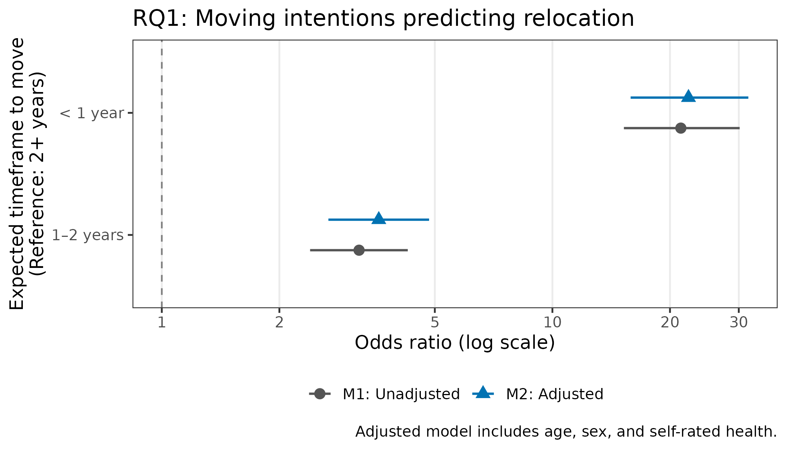
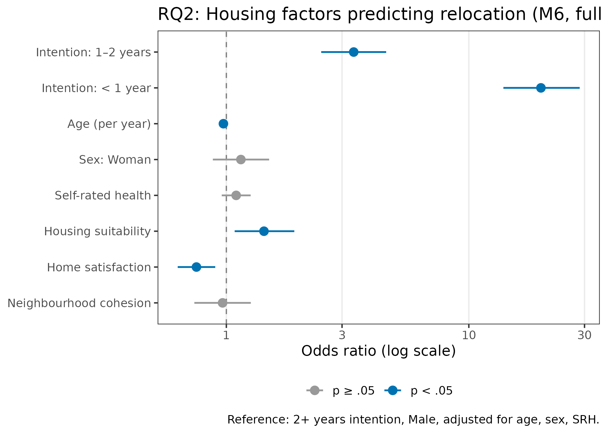
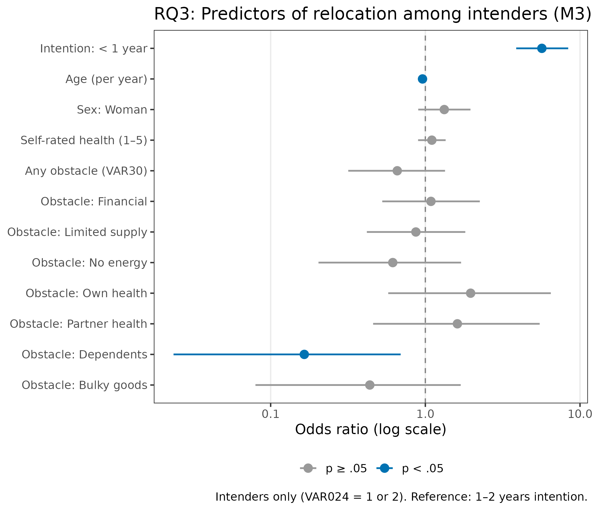
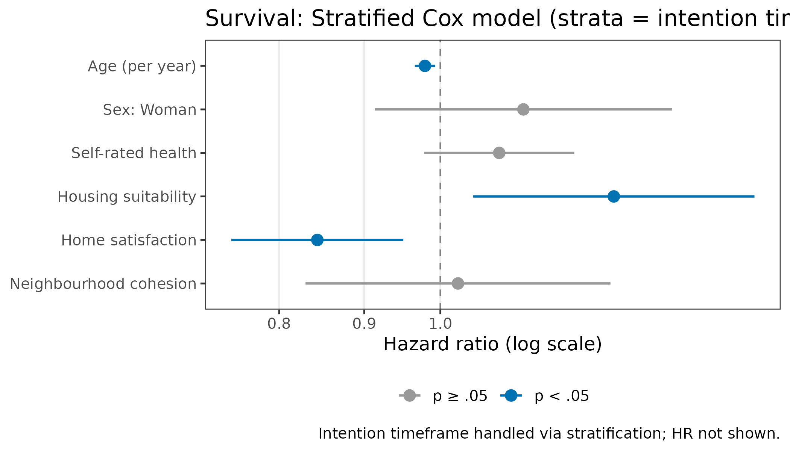

```{r setup}
library(tidyverse)
library(flextable)

set_flextable_defaults(fonts_ignore = TRUE)

ft_style <- function(ft, caption = NULL) {
  ft |>
    theme_booktabs() |>
    autofit() |>
    set_caption(caption = caption)
}

rq1_reloc   <- read_csv("tables/RQ1_relocation_by_intention.csv",    show_col_types = FALSE)
rq1_m1      <- read_csv("tables/RQ1_m1_coefficients.csv",            show_col_types = FALSE)
rq1_m2      <- read_csv("tables/RQ1_m2_coefficients.csv",            show_col_types = FALSE)
rq1_fit     <- read_csv("tables/RQ1_model_fit.csv",                  show_col_types = FALSE)

rq2_desc    <- read_csv("tables/RQ2_housing_descriptives.csv",       show_col_types = FALSE)
rq2_coef    <- read_csv("tables/RQ2_all_coefficients.csv",           show_col_types = FALSE)
rq2_fit     <- read_csv("tables/RQ2_model_fit.csv",                  show_col_types = FALSE)
rq2_lrt     <- read_csv("tables/RQ2_lrt.csv",                        show_col_types = FALSE)

rq3_sample  <- read_csv("tables/RQ3_intender_sample.csv",            show_col_types = FALSE)
rq3_obs     <- read_csv("tables/RQ3_obstacle_prevalence.csv",        show_col_types = FALSE)
rq3_coef    <- read_csv("tables/RQ3_all_coefficients.csv",           show_col_types = FALSE)
rq3_fit     <- read_csv("tables/RQ3_model_fit.csv",                  show_col_types = FALSE)
rq3_lrt     <- read_csv("tables/RQ3_lrt.csv",                        show_col_types = FALSE)

surv_sample <- read_csv("tables/survival_sample.csv",                show_col_types = FALSE)
surv_m2     <- read_csv("tables/survival_cox_m2.csv",                show_col_types = FALSE)
surv_strat  <- read_csv("tables/survival_cox_stratified.csv",        show_col_types = FALSE)
```

\newpage

# Abstract

**Background.** Moving intentions are widely used as proxies for future behaviour in housing and ageing research, yet evidence on their predictive validity in older adult populations is limited.

**Objectives.** This paper addresses three research questions: (RQ1) To what extent do self-reported moving intentions at baseline predict actual relocation over three years? (RQ2) Do housing-related factors—suitability, satisfaction, and neighbourhood cohesion—predict relocation independent of intentions? (RQ3) Among those who intended to move, which factors are associated with not having relocated after three years? A supplementary survival analysis examines the timing of relocation.

**Methods.** Prospective longitudinal survey study (*N* = 1,958) of older adults registered on a Swedish municipal housing company interest list (T1 = 2021, T2 = 2022, T3 = 2024). Outcomes were obtained from a linked Swedish population register (LISA). Binary logistic regression and Cox proportional hazards models were used.

**Results.** Moving intentions were strong predictors of relocation: those expecting to move within one year had 22 times the odds of having relocated by T3 compared to those not planning to move within two years (OR = 22.3, 95% CI [15.9, 31.7]). Home satisfaction independently predicted relocation beyond intentions, and housing suitability emerged as a significant predictor in the full housing model and survival analyses. Among intenders, having dependents was the only obstacle significantly associated with not relocating (OR = 0.17).

**Conclusions.** Self-reported moving intentions are strong behavioural predictors among older adults on housing interest lists. Housing satisfaction and suitability shape the realisation of intentions, and caring responsibilities can prevent planned moves from occurring.

**Keywords:** moving intentions, older adults, residential relocation, longitudinal study, predictive validity, housing

\newpage

# Introduction

Residential relocation in later life is a significant life event with implications for health, social connectedness, and housing system functioning. Understanding which older adults move—and why some who intend to move do not—is of growing policy relevance as populations age and pressures on housing markets intensify.

Moving intentions are commonly measured as a proxy for actual behaviour, grounded in theories of planned behaviour that posit intentions as the proximal cause of action. However, the gap between intention and behaviour is well documented. Factors such as housing market constraints, attachment to home and neighbourhood, health status, and competing responsibilities may all moderate whether an intention translates into an actual move.

This study draws on a prospective longitudinal cohort of older adults registered on a Swedish municipal housing company interest list—a group with a demonstrated interest in changing their housing situation. This context is particularly informative because all participants had taken a concrete step toward potential relocation by registering, making it possible to examine what distinguishes those who ultimately move from those who do not.

The present paper addresses three research questions:

- **RQ1:** To what extent do self-reported moving intentions at baseline predict actual relocation over a three-year period?
- **RQ2:** To what extent do housing-related factors at baseline (housing suitability, home satisfaction, neighbourhood cohesion) predict actual relocation, independent of moving intentions?
- **RQ3:** Among those who intended to move at baseline, which factors—housing, demographic, or perceived obstacles—are associated with *not* having relocated after three years?

A supplementary survival analysis examines the timing of relocation in relation to intentions and housing factors.

\newpage

# Methods

## Study design and data sources

This is a prospective longitudinal survey study with three waves of data collection: T1 (2021), T2 (2022), and T3 (2024). The study population comprises individuals registered on a Swedish municipal housing company interest list. Survey data were linked to the Swedish Longitudinal Integration Database for Health Insurance and Labour Market Studies (LISA) to obtain register-based outcomes including relocation dates.

## Participants

The baseline sample comprised *N* = 1,958 individuals. Response rates at follow-up were 76.7% at T2 and 66.2% at T3. Baseline characteristics are presented in Table 1.

```{r table-1-desc}
tribble(
  ~Characteristic,                           ~Value,
  "Age, mean (SD)",                           "68.7 (7.7)",
  "Age, range",                               "54–90 years",
  "Sex: Women, n (%)",                        "1,084 (55.4%)",
  "Self-rated health (1–5), mean (SD)",       "3.5 (1.0)",
  "Housing suitability (1–5), mean (SD)",     "4.7 (0.5)",
  "Home satisfaction (1–5), mean (SD)",       "4.6 (0.8)",
  "Neighbourhood cohesion (1–3), mean (SD)",  "2.2 (0.5)",
  "Moving intention: 2+ years, n (%)",        "1,286 (65.7%)",
  "Moving intention: 1–2 years, n (%)",       "385 (19.7%)",
  "Moving intention: < 1 year, n (%)",        "224 (11.4%)"
) |>
  flextable() |>
  ft_style(caption = "Table 1. Baseline sample characteristics (T1, N = 1,958).")
```

## Sample attrition

Figure 0 shows cohort flow across the three survey waves. Relocation outcomes were ascertained for all enrolled participants via register linkage (LISA), regardless of survey response at follow-up. A total of 30 deaths occurred during the study period (10 between T1 and T2; 14 between T2 and T3; 6 at or after T3). Twenty-one participants had no register match and were excluded from analyses requiring register-derived outcomes.

```{mermaid}
%%| fig-cap: "Figure 0. Cohort flow diagram."
%%| fig-width: 6

flowchart TD
    A["Registered on housing company interest list\nEnrolled at T1\n**N = 1,958**"]

    A --> B["**T1 — 2021**\nSurvey completed\n*n* = 1,958 (100%)"]

    B --> D1["Lost to follow-up T1 → T2\n*n* = 457\n(10 deaths; 447 non-response)"]
    B --> C["**T2 — 2022**\nSurvey completed\n*n* = 1,501 (76.7%)"]

    C --> D2["Lost to follow-up T2 → T3\n*n* = 205\n(14 deaths; 191 non-response)"]
    C --> E["**T3 — 2024**\nSurvey completed\n*n* = 1,296 (66.2%)"]

    B -. "Register linkage (LISA)\nOutcomes ascertained for all enrolled" .-> F

    E --> F["**Analytical samples**\nRQ1 / RQ2 (T1 baseline): *n* = 1,890\nRQ3 (intenders only): *n* = 609\nSurvival analysis: *n* = 1,890"]

    D1:::excl
    D2:::excl

    classDef excl fill:#f5f5f5,stroke:#aaa,color:#555,font-style:italic
```

## Measures

**Outcome.** Relocation was defined as a registered change of address from the baseline dwelling, as recorded in the LISA register. Relocation date was used for survival analyses.

**Moving intentions** were assessed with a single item asking respondents when they expected to move (VAR024). Responses were recoded into three categories: *< 1 year*, *1–2 years*, and *2+ years* (reference). The 1–2 year and < 1 year categories are jointly referred to as *intenders* in RQ3.

**Housing-related factors.** Three continuous composite measures were included:

- *Housing suitability* — whether the current dwelling is physically suitable for the respondent's needs (1–5 scale)
- *Home satisfaction* — overall satisfaction with the current dwelling (1–5 scale)
- *Neighbourhood cohesion* — sense of social cohesion with neighbours and neighbourhood (1–3 scale)

**Perceived obstacles.** Among intenders, a battery of items (VAR030) assessed the presence of specific barriers to moving: financial constraints, limited housing supply, lack of energy/motivation, own health, partner health, dependents, and bulky possessions.

**Covariates.** Age (continuous, years), sex (Man/Woman), and self-rated health (SRH; 1–5 continuous scale).

## Analysis

**RQ1 and RQ2** used binary logistic regression on the full analytical sample (T1 baseline). Three models were estimated for RQ1: M0 (null), M1 (intentions only), M2 (intentions + age + sex + SRH). For RQ2, three additional models added housing suitability (M3), home satisfaction (M4), neighbourhood cohesion (M5), and all three housing factors simultaneously (M6, full model). Likelihood ratio tests compared nested models. Model fit was assessed with AIC and Nagelkerke's pseudo-*R²*.

**RQ3** used binary logistic regression restricted to intenders (VAR024 = 1 or 2). Four models were estimated: M1 (demographics + intention level), M2 (+ housing factors), M3 (+ obstacles), M4 (full model). Common complete-case samples were used across all RQ3 models.

**Survival analysis.** Cox proportional hazards models estimated time to first relocation (months from T1 survey date). Censoring rules: event = relocation date from register; censored at T3 survey date for non-relocated T3 respondents; administratively censored at study end (2024-11-13) for those without a T3 response. The proportional hazards assumption was tested with Schoenfeld residuals; a stratified Cox model (stratified by intention timeframe) was used as the primary model after violation was detected in unstratified models.

\newpage

# Results

## RQ1: Do moving intentions predict relocation?

The analytical sample for RQ1 comprised individuals with complete data on the outcome, intentions, age, sex, and SRH. Relocation rates by intention timeframe are shown in Table 2.

```{r table-rq1-reloc}
rq1_reloc |>
  rename(
    `Intention timeframe` = intention_timeframe,
    `N`                   = n,
    `N relocated`         = n_relocated,
    `% relocated`         = pct
  ) |>
  flextable() |>
  ft_style(caption = "Table 2. Relocation rates by moving intention timeframe (RQ1 sample).")
```

Relocation rates showed a steep gradient: 10.4% among those not planning to move for 2+ years, rising to 27.2% for 1–2 year intenders and 71.3% for those expecting to move within a year.

Odds ratios from logistic regression models M1 (unadjusted) and M2 (adjusted) are presented in Table 3.

```{r table-rq1-coef}
bind_rows(rq1_m1, rq1_m2) |>
  mutate(
    term = recode(term,
      "intention_timeframe1–2 years" = "Intention: 1–2 years",
      "intention_timeframe< 1 year"  = "Intention: < 1 year",
      "age"                          = "Age (per year)",
      "sexWoman"                     = "Sex: Woman",
      "srh"                          = "Self-rated health"
    ),
    OR_CI = sprintf("%.2f [%.2f, %.2f]", estimate, conf.low, conf.high),
    p_fmt = ifelse(p.value < 0.001, "< .001", sprintf("%.3f", p.value))
  ) |>
  select(Model = model, Term = term, `OR [95% CI]` = OR_CI, `p` = p_fmt) |>
  flextable() |>
  merge_v(j = "Model") |>
  ft_style(caption = "Table 3. Logistic regression: moving intentions predicting relocation (RQ1). Reference: intention 2+ years.")
```

```{r table-rq1-fit}
rq1_fit |>
  rename(
    Model            = model,
    `Nagelkerke R²`  = nagelkerke_r2,
    `ΔAIC vs null`   = delta_aic
  ) |>
  flextable() |>
  ft_style(caption = "Table 4. Model fit statistics for RQ1 models.")
```

Moving intentions were strongly and significantly associated with relocation. In the adjusted model (M2), the odds of relocation were 3.6 times higher for 1–2 year intenders (OR = 3.59, 95% CI [2.67, 4.83], *p* < .001) and 22.3 times higher for < 1 year intenders (OR = 22.31, 95% CI [15.86, 31.74], *p* < .001) compared to the reference group (2+ years). Older age was associated with reduced odds of relocation (OR = 0.97 per year, 95% CI [0.95, 0.99], *p* = .001). Sex and SRH were not significant. The adjusted model accounted for 28.8% of variance (Nagelkerke R² = 0.288).



\newpage

## RQ2: Do housing factors predict relocation beyond intentions?

Descriptive statistics for the three housing variables are shown in Table 5.

```{r table-rq2-desc}
rq2_desc |>
  mutate(Variable = recode(var,
    "housing_suitability"    = "Housing suitability (1–5)",
    "home_satisfaction"      = "Home satisfaction (1–5)",
    "neighbourhood_cohesion" = "Neighbourhood cohesion (1–3)"
  )) |>
  select(Variable, Mean = mean, SD = sd) |>
  flextable() |>
  ft_style(caption = "Table 5. Descriptive statistics for housing variables (RQ2 analytical sample).")
```

Table 6 presents coefficients from the full housing model (M6). Table 7 shows model fit and likelihood ratio test results for all RQ2 models.

```{r table-rq2-coef}
rq2_coef |>
  filter(model == "M6") |>
  mutate(
    term = recode(term,
      "intention_timeframe1–2 years" = "Intention: 1–2 years",
      "intention_timeframe< 1 year"  = "Intention: < 1 year",
      "age"                          = "Age (per year)",
      "sexWoman"                     = "Sex: Woman",
      "srh"                          = "Self-rated health",
      "housing_suitability"          = "Housing suitability",
      "home_satisfaction"            = "Home satisfaction",
      "neighbourhood_cohesion"       = "Neighbourhood cohesion"
    ),
    OR_CI = sprintf("%.2f [%.2f, %.2f]", estimate, conf.low, conf.high),
    p_fmt = ifelse(p.value < 0.001, "< .001", sprintf("%.3f", p.value))
  ) |>
  select(Term = term, `OR [95% CI]` = OR_CI, `p` = p_fmt) |>
  flextable() |>
  ft_style(caption = "Table 6. Full housing model (M6): all predictors of relocation (RQ2). Reference: intention 2+ years, Male.")
```

```{r table-rq2-fit}
lrt_lookup <- rq2_lrt |>
  mutate(model_key = recode(model,
    "M3" = "M3 (+suitability)",
    "M4" = "M4 (+satisfaction)",
    "M5" = "M5 (+cohesion)",
    "M6" = "M6 (full housing)"
  )) |>
  select(model_key, p_value)

rq2_fit |>
  left_join(lrt_lookup, by = c("model" = "model_key")) |>
  mutate(
    lrt_p_fmt = case_when(
      is.na(p_value)   ~ "—",
      p_value < .001   ~ "< .001",
      TRUE             ~ sprintf("%.3f", p_value)
    )
  ) |>
  rename(
    Model           = model,
    `Nagelkerke R²` = nagelkerke_r2,
    `ΔAIC vs M2`    = delta_aic,
    `LRT p vs M2`   = lrt_p_fmt
  ) |>
  select(Model, AIC, `Nagelkerke R²`, `ΔAIC vs M2`, `LRT p vs M2`) |>
  flextable() |>
  ft_style(caption = "Table 7. Model fit and likelihood ratio tests for RQ2 models (vs M2 baseline).")
```

Home satisfaction was a significant negative predictor of relocation in the full model (M6: OR = 0.75, 95% CI [0.63, 0.90], *p* = .002): those more satisfied with their home were less likely to have relocated. Housing suitability was a positive predictor (OR = 1.43, 95% CI [1.08, 1.91], *p* = .013). Neighbourhood cohesion was not a significant predictor. The full housing model (M6) improved fit significantly over the baseline (LRT *p* = .010, ΔAIC = −5.5).



\newpage

## RQ3: Barriers to relocation among intenders

The intender sample comprised 609 individuals (VAR024 = 1 or 2). Table 8 shows relocation rates by intention level, and Table 9 shows the prevalence of perceived obstacles.

```{r table-rq3-sample}
rq3_sample |>
  rename(
    `Intention level` = intention_level,
    `N`               = n,
    `N relocated`     = relocated,
    `% relocated`     = pct
  ) |>
  flextable() |>
  ft_style(caption = "Table 8. Relocation rates by intention level among intenders (RQ3 sample).")
```

```{r table-rq3-obstacles}
rq3_obs |>
  rename(Obstacle = obstacle, `N endorsed` = n_endorsed, `%` = pct) |>
  flextable() |>
  ft_style(caption = "Table 9. Prevalence of perceived obstacles to moving among intenders (N = 609).")
```

Thirty percent of intenders endorsed at least one obstacle to moving. The most common were limited housing supply (17.2%) and financial constraints (12.3%).

Table 10 presents odds ratios from M3 (demographics + intention level + obstacles), which achieved the best AIC of all four RQ3 models.

```{r table-rq3-coef}
rq3_coef |>
  filter(model == "M3") |>
  mutate(
    OR_CI = sprintf("%.2f [%.2f, %.2f]", estimate, conf.low, conf.high),
    p_fmt = ifelse(p.value < 0.001, "< .001", sprintf("%.3f", p.value)),
    sig   = case_when(
      p.value < .001 ~ "***",
      p.value < .01  ~ "**",
      p.value < .05  ~ "*",
      TRUE           ~ ""
    )
  ) |>
  select(Term = term, `OR [95% CI]` = OR_CI, `p` = p_fmt, ` ` = sig) |>
  flextable() |>
  ft_style(caption = "Table 10. Logistic regression among intenders — M3 (demographics + intention + obstacles; best AIC). Reference: intention 1–2 years.")
```

```{r table-rq3-fit}
lrt_rq3_lookup <- bind_rows(
  tibble(model_key = "M1 (demo + intention)", p_value = NA_real_),
  rq3_lrt |> mutate(model_key = recode(model,
    "M2" = "M2 (+housing)",
    "M3" = "M3 (+obstacles)",
    "M4" = "M4 (full)"
  )) |> select(model_key, p_value)
)

rq3_fit |>
  left_join(lrt_rq3_lookup, by = c("model" = "model_key")) |>
  mutate(
    lrt_p_fmt = case_when(
      is.na(p_value) ~ "—",
      p_value < .001 ~ "< .001",
      TRUE           ~ sprintf("%.3f", p_value)
    )
  ) |>
  rename(
    Model           = model,
    `Nagelkerke R²` = nagelkerke_r2,
    `ΔAIC vs M1`    = delta_aic,
    `LRT p vs M1`   = lrt_p_fmt
  ) |>
  select(Model, AIC, `Nagelkerke R²`, `ΔAIC vs M1`, `LRT p vs M1`) |>
  flextable() |>
  ft_style(caption = "Table 11. Model fit and likelihood ratio tests for RQ3 models (vs M1 baseline).")
```

Among the eight obstacle types, only having dependents was a statistically significant predictor: those with dependents had substantially lower odds of having relocated (OR = 0.17, 95% CI [0.02, 0.69], *p* = .029). The obstacles model (M3) significantly improved fit over the demographics-only baseline (LRT *p* = .013). Housing factors did not add significantly beyond demographics (LRT *p* = .486 for M2 vs M1).

Intention level remained a strong predictor within the intender sample: those expecting to move within < 1 year had approximately 5.7 times the odds of relocation compared to 1–2 year intenders (M3: OR = 5.67, 95% CI [3.87, 8.39], *p* < .001). Older age was again associated with reduced odds (OR = 0.96 per year, *p* = .002).



\newpage

## Supplementary: Survival analysis (time to relocation)

The survival sample comprised *N* = 1,890 individuals with complete data. The median follow-up was 37.4 months (Table 12).

```{r table-surv-sample}
surv_sample |>
  rename(
    `N`                          = n,
    `Events (relocated)`         = n_events,
    `Censored`                   = n_censored,
    `Censored: T3 response`      = n_t3_responded,
    `Censored: administrative`   = n_admin_censored,
    `Median follow-up (months)`  = median_followup
  ) |>
  flextable() |>
  ft_style(caption = "Table 12. Survival analysis sample summary.")
```

The proportional hazards assumption was violated for intention timeframe in the unstratified adjusted Cox model (Schoenfeld test *χ²* = 56.58, *p* < .001), indicating that hazard ratios for intention groups changed over the observation period. A stratified Cox model (stratifying on intention timeframe) was adopted as the primary model; this model satisfied the global PH assumption (*χ²* = 4.96, *p* = .549).

Table 13 presents the adjusted unstratified Cox M2 results, and Table 14 presents the primary stratified Cox model.

```{r table-surv-m2}
surv_m2 |>
  mutate(
    term = recode(term,
      "intention_timeframe1–2 years" = "Intention: 1–2 years",
      "intention_timeframe< 1 year"  = "Intention: < 1 year",
      "age"                          = "Age (per year)",
      "sexWoman"                     = "Sex: Woman",
      "srh"                          = "Self-rated health"
    ),
    HR_CI = sprintf("%.2f [%.2f, %.2f]", estimate, conf.low, conf.high),
    p_fmt = ifelse(p.value < 0.001, "< .001", sprintf("%.3f", p.value))
  ) |>
  select(Term = term, `HR [95% CI]` = HR_CI, `p` = p_fmt) |>
  flextable() |>
  add_footer_lines("Concordance = 0.758. Note: PH assumption violated for intention timeframe; stratified model is primary.") |>
  ft_style(caption = "Table 13. Cox M2: Adjusted unstratified model (intention + age + sex + SRH).")
```

```{r table-surv-strat}
surv_strat |>
  mutate(
    term = recode(term,
      "age"                    = "Age (per year)",
      "sexWoman"               = "Sex: Woman",
      "srh"                    = "Self-rated health",
      "housing_suitability"    = "Housing suitability",
      "home_satisfaction"      = "Home satisfaction",
      "neighbourhood_cohesion" = "Neighbourhood cohesion"
    ),
    HR_CI = sprintf("%.2f [%.2f, %.2f]", estimate, conf.low, conf.high),
    p_fmt = ifelse(p.value < 0.001, "< .001", sprintf("%.3f", p.value))
  ) |>
  select(Term = term, `HR [95% CI]` = HR_CI, `p` = p_fmt) |>
  flextable() |>
  add_footer_lines("Concordance = 0.588. Intention timeframe handled via stratification (HR not estimable). Global PH test: p = .549.") |>
  ft_style(caption = "Table 14. Primary model: Stratified Cox (strata = intention timeframe) with housing factors.")
```

Housing suitability (HR = 1.27, 95% CI [1.05, 1.55], *p* = .016) and home satisfaction (HR = 0.84, 95% CI [0.75, 0.95], *p* = .005) were both significant predictors of time to relocation, consistent with the logistic regression findings. Higher suitability was associated with faster relocation; higher home satisfaction with delayed relocation. Neighbourhood cohesion and sex were not significant. Older age was associated with slower time to relocation (HR = 0.98 per year, *p* = .003).



\newpage

# Discussion

*[Placeholder — to be completed.]*

The analyses consistently show that self-reported moving intentions are strong predictors of actual residential relocation among older adults on a housing interest list, with a clear gradient by intended timeframe. The finding that housing satisfaction independently predicts relocation—in the expected direction—suggests that dissatisfaction with the current dwelling is an additional driver of behaviour beyond intention alone. Conversely, high suitability of the current dwelling was positively associated with relocation, which may reflect that those already in age-appropriate housing are more *able* (rather than less motivated) to make a planned transition.

Among intenders, caring for dependents emerged as the primary barrier to completing a planned move—a finding with practical relevance for housing support services. Other obstacle types, including financial constraints and limited housing supply, though frequently endorsed, did not significantly predict relocation failure in regression models.

The survival analysis confirmed the logistic regression conclusions while adding a time dimension: intention timeframe shapes not only *whether* one moves but *when*, though its effect on the hazard is non-proportional over the observation period.

**Limitations.** The study relies on a specific population (housing interest list registrants), limiting generalisability to the broader older adult population. Self-reported relocation was not used—register data provide objective outcomes—but unmeasured confounding remains possible. Attrition at T3 (33.8%) may introduce bias if non-respondents differed systematically from completers.

\newpage

# References

*[To be completed.]*
