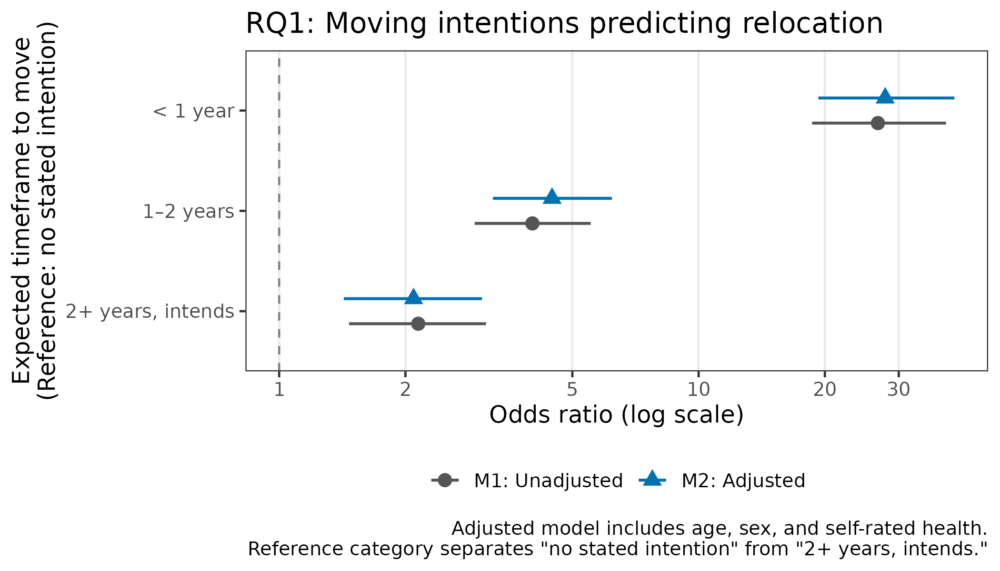
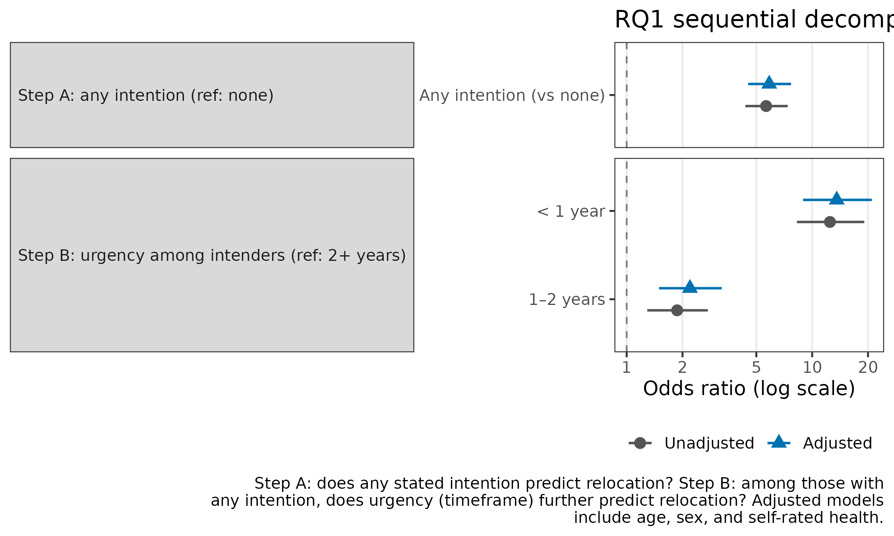
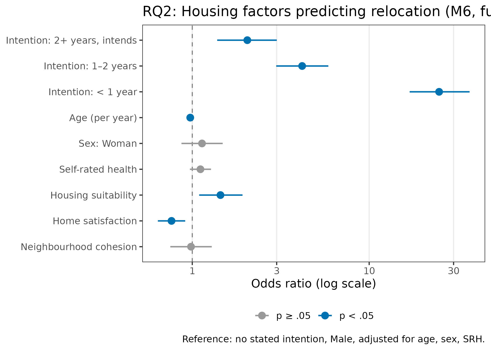
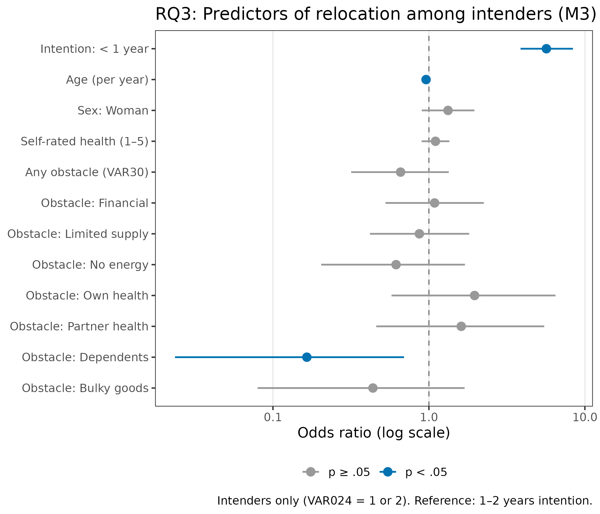
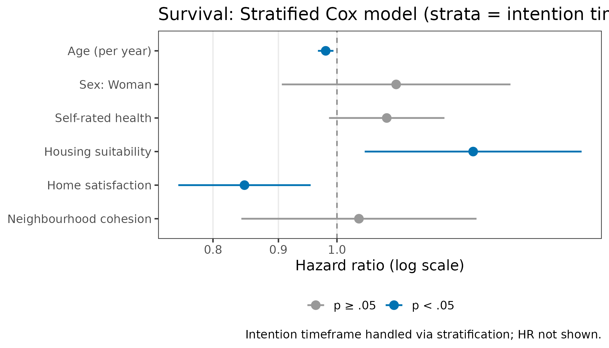
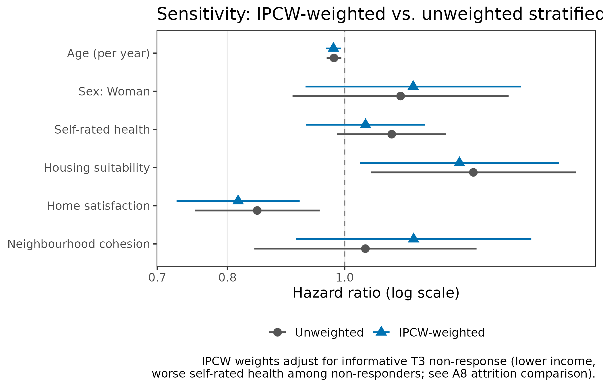

```{r setup}
library(tidyverse)
library(flextable)

set_flextable_defaults(fonts_ignore = TRUE)

ft_style <- function(ft, caption = NULL) {
  ft |>
    theme_booktabs() |>
    autofit() |>
    set_caption(caption = caption)
}

rq1_reloc     <- read_csv("tables/RQ1_relocation_by_intention.csv",    show_col_types = FALSE)
rq1_m1        <- read_csv("tables/RQ1_m1_coefficients.csv",            show_col_types = FALSE)
rq1_m2        <- read_csv("tables/RQ1_m2_coefficients.csv",            show_col_types = FALSE)
rq1_fit       <- read_csv("tables/RQ1_model_fit.csv",                  show_col_types = FALSE)
rq1_stepA     <- read_csv("tables/RQ1_stepA_coefficients.csv",         show_col_types = FALSE)
rq1_stepB     <- read_csv("tables/RQ1_stepB_coefficients.csv",         show_col_types = FALSE)
rq1_seq_fit   <- read_csv("tables/RQ1_sequential_model_fit.csv",       show_col_types = FALSE)
rq1_ses_comp  <- read_csv("tables/RQ1_ses_adjusted_comparison.csv",    show_col_types = FALSE)

rq2_desc      <- read_csv("tables/RQ2_housing_descriptives.csv",       show_col_types = FALSE)
rq2_coef      <- read_csv("tables/RQ2_all_coefficients.csv",           show_col_types = FALSE)
rq2_fit       <- read_csv("tables/RQ2_model_fit.csv",                  show_col_types = FALSE)
rq2_lrt       <- read_csv("tables/RQ2_lrt.csv",                        show_col_types = FALSE)
rq2_vif       <- read_csv("tables/RQ2_vif.csv",                        show_col_types = FALSE)
rq2_cor       <- read_csv("tables/RQ2_housing_correlations.csv",       show_col_types = FALSE)
rq2_linearity <- read_csv("tables/RQ2_linearity_check.csv",            show_col_types = FALSE)

rq3_sample    <- read_csv("tables/RQ3_intender_sample.csv",            show_col_types = FALSE)
rq3_obs       <- read_csv("tables/RQ3_obstacle_prevalence.csv",        show_col_types = FALSE)
rq3_coef      <- read_csv("tables/RQ3_all_coefficients.csv",           show_col_types = FALSE)
rq3_fit       <- read_csv("tables/RQ3_model_fit.csv",                  show_col_types = FALSE)
rq3_lrt       <- read_csv("tables/RQ3_lrt.csv",                        show_col_types = FALSE)
rq3_epv       <- read_csv("tables/RQ3_epv.csv",                        show_col_types = FALSE)
rq3_firth     <- read_csv("tables/RQ3_dependents_firth_comparison.csv",show_col_types = FALSE)

surv_sample   <- read_csv("tables/survival_sample.csv",                show_col_types = FALSE)
surv_m2       <- read_csv("tables/survival_cox_m2.csv",                show_col_types = FALSE)
surv_strat    <- read_csv("tables/survival_cox_stratified.csv",        show_col_types = FALSE)
surv_ipcw     <- read_csv("tables/survival_cox_stratified_ipcw.csv",   show_col_types = FALSE)
```

\newpage

# Abstract

**Background.** Moving intentions are widely used as proxies for future behaviour in housing and ageing research, yet evidence on their predictive validity in older adult populations is limited.

**Objectives.** This paper addresses three research questions: (RQ1) To what extent do self-reported moving intentions at baseline predict actual relocation over three years? (RQ2) Do housing-related factors—suitability, satisfaction, and neighbourhood cohesion—predict relocation independent of intentions? (RQ3) Among those who intended to move, which factors are associated with not having relocated after three years? A supplementary survival analysis examines the timing of relocation.

**Methods.** Prospective longitudinal survey study (*N* = 1,958) of older adults registered on a Swedish municipal housing company interest list (T1 = 2021, T2 = 2022, T3 = 2024). Outcomes were obtained from a linked Swedish population register (LISA). Binary logistic regression and Cox proportional hazards models were used. A key methodological step was separating "no stated intention to move" from "intends to move but 2+ years out" — the single item used in earlier work blends these two groups, which relocated at very different rates (8.5% vs. 16.6%).

**Results.** Having any stated intention to move at baseline was associated with substantially higher odds of relocation than having none (OR = 5.9, 95% CI [4.5, 7.7]). Among those with a stated intention, timeframe closely tracked when relocation actually occurred: the odds of relocation were roughly 2 times higher for 1–2 year intenders and 14 times higher for those expecting to move within a year, relative to those still expecting 2 or more years (OR = 2.2 and 13.6, respectively). Home satisfaction independently predicted relocation beyond intentions, and housing suitability emerged as a significant predictor in the full housing model and survival analyses; neither showed evidence of problematic collinearity (VIF < 1.6). The intention effect was essentially unchanged after adjusting for register-measured income, marital status, and employment. Among intenders, having dependents was associated with lower odds of relocating (Firth-corrected OR = 0.21, 95% CI [0.04, 0.81]; standard maximum-likelihood OR = 0.17), though this estimate is based on only 18 respondents endorsing this obstacle and should be treated as exploratory.

**Conclusions.** Self-reported moving intentions, and particularly their stated timeframe, closely track actual relocation behaviour among older adults on housing interest lists. Housing satisfaction and suitability shape the realisation of intentions independent of stated timeframe. Non-relocation among intenders was not well explained by the housing or health factors measured here, suggesting unmeasured barriers, potentially structural or market-related, that this dataset cannot directly test; this is explored further in a companion paper.

**Keywords:** moving intentions, older adults, residential relocation, longitudinal study, predictive validity, housing

\newpage

# Introduction

Residential relocation in later life is a significant life event with implications for health, social connectedness, and housing system functioning. Understanding which older adults move—and why some who intend to move do not—is of growing policy relevance as populations age and pressures on housing markets intensify.

Moving intentions are commonly measured as a proxy for actual behaviour, grounded in theories of planned behaviour that posit intentions as the proximal cause of action. However, the gap between intention and behaviour is well documented. Factors such as housing market constraints, attachment to home and neighbourhood, health status, and competing responsibilities may all moderate whether an intention translates into an actual move.

This study draws on a prospective longitudinal cohort of older adults registered on a Swedish municipal housing company interest list—a group with a demonstrated interest in changing their housing situation. This context is particularly informative because all participants had taken a concrete step toward potential relocation by registering, making it possible to examine what distinguishes those who ultimately move from those who do not.

The present paper addresses three research questions:

- **RQ1:** To what extent do self-reported moving intentions at baseline predict actual relocation over a three-year period?
- **RQ2:** To what extent do housing-related factors at baseline (housing suitability, home satisfaction, neighbourhood cohesion) predict actual relocation, independent of moving intentions?
- **RQ3:** Among those who intended to move at baseline, which factors—housing, demographic, or perceived obstacles—are associated with *not* having relocated after three years?

A supplementary survival analysis examines the timing of relocation in relation to intentions and housing factors.

\newpage

# Methods

## Study design and data sources

This is a prospective longitudinal survey study with three waves of data collection: T1 (2021), T2 (2022), and T3 (2024). The study population comprises individuals registered on a Swedish municipal housing company interest list. Survey data were linked to the Swedish Longitudinal Integration Database for Health Insurance and Labour Market Studies (LISA) to obtain register-based outcomes including relocation dates.

## Participants

The baseline sample comprised *N* = 1,958 individuals. Response rates at follow-up were 76.7% at T2 and 66.2% at T3. Baseline characteristics are presented in Table 1. (An earlier internal version of this manuscript reported *N* = 1,964; the six-person difference reflects additional exclusions applied during data cleaning and register linkage and does not affect any reported association.)

```{r table-1-desc}
tribble(
  ~Characteristic,                           ~Value,
  "Age, mean (SD)",                           "68.7 (7.7)",
  "Age, range",                               "54–90 years",
  "Sex: Women, n (%)",                        "1,084 (55.4%)",
  "Self-rated health (1–5), mean (SD)",       "3.5 (1.0)",
  "Housing suitability (1–5), mean (SD)",     "4.7 (0.5)",
  "Home satisfaction (1–5), mean (SD)",       "4.6 (0.8)",
  "Neighbourhood cohesion (1–3), mean (SD)",  "2.2 (0.5)",
  "Moving intention: no stated intention, n (%)", "979 (50.0%)",
  "Moving intention: 2+ years, intends, n (%)",   "307 (15.7%)",
  "Moving intention: 1–2 years, n (%)",       "385 (19.7%)",
  "Moving intention: < 1 year, n (%)",        "224 (11.4%)"
) |>
  flextable() |>
  ft_style(caption = "Table 1. Baseline sample characteristics (T1, N = 1,958). Intention percentages are of N = 1,958; the remaining 3.2% have missing data on the intention item (see Measures).")
```

## Sample attrition

Figure 0 shows cohort flow across the three survey waves. Relocation outcomes were ascertained for all enrolled participants via register linkage (LISA), regardless of survey response at follow-up. A total of 30 deaths occurred during the study period (10 between T1 and T2; 14 between T2 and T3; 6 at or after T3). Twenty-one participants had no register match and were excluded from analyses requiring register-derived outcomes.

```{mermaid}
%%| fig-cap: "Figure 0. Cohort flow diagram."
%%| fig-width: 6

flowchart TD
    A["Registered on housing company interest list\nEnrolled at T1\n**N = 1,958**"]

    A --> B["**T1 — 2021**\nSurvey completed\n*n* = 1,958 (100%)"]

    B --> D1["Lost to follow-up T1 → T2\n*n* = 457\n(10 deaths; 447 non-response)"]
    B --> C["**T2 — 2022**\nSurvey completed\n*n* = 1,501 (76.7%)"]

    C --> D2["Lost to follow-up T2 → T3\n*n* = 205\n(14 deaths; 191 non-response)"]
    C --> E["**T3 — 2024**\nSurvey completed\n*n* = 1,296 (66.2%)"]

    B -. "Register linkage (LISA)\nOutcomes ascertained for all enrolled" .-> F

    E --> F["**Analytical samples**\nRQ1 / RQ2 (T1 baseline): *n* = 1,890\nRQ3 (intenders only): *n* = 609\nSurvival analysis: *n* = 1,890"]

    D1:::excl
    D2:::excl

    classDef excl fill:#f5f5f5,stroke:#aaa,color:#555,font-style:italic
```

## Measures

**Outcome.** Relocation was defined as a registered change of address from the baseline dwelling, as recorded in the LISA register. Relocation date was used for survival analyses.

**Moving intentions** were constructed from two items. The first (VAR024) asked respondents when they expected to move, with three response options: *less than 1 year*, *1–2 years*, or *2 years or more*. The second (VAR021_1) asked why respondents had joined the housing-company interest list and included the option "I am on the waiting list but have no plans to move at this time" (yes/no). Both items were asked of the full baseline sample; VAR024 is not a filtered follow-up restricted to those who denied VAR021_1, so this is not a skip-logic pair.

Recoding VAR024 alone, as in earlier work on this cohort, treats "2 years or more" as the lowest-intention reference category. This blends two groups with very different relocation rates: respondents who also endorsed "no plans to move" (n = 979, 8.5% relocated) and respondents who gave an active reason for joining the list despite a distant timeframe (n = 307, 16.6% relocated) — roughly double the relocation rate. A four-level variable was constructed instead: *no stated intention* (VAR021_1 = "no plans" and VAR024 = "2+ years"; reference), *2+ years, intends* (VAR024 = "2+ years" but VAR021_1 ≠ "no plans"), *1–2 years*, and *< 1 year*.

When the two items conflicted — a respondent endorsed "no plans to move" but nonetheless gave a timeframe shorter than 2+ years (n = 102) — the stated timeframe was treated as authoritative. This was an empirical rather than purely conservative choice: these 102 respondents relocated at 27.5%, closer to the intender groups than to either "2+ years" group, indicating that the stated timeframe better captured their eventual behaviour than the checkbox item did. Respondents missing VAR024 (n = 63, 3.2%) were excluded from analyses using this variable, regardless of their VAR021_1 response, since VAR024 was required to complete the four-way classification.

The 1–2 year and < 1 year categories are jointly referred to as *any stated intention* or, together with the *2+ years, intends* category, as *intenders*; RQ3 restricts to the narrower *expecting to move within 2 years* definition (1–2 years or < 1 year) used in earlier work on this cohort, for continuity with that literature.

**Housing-related factors.** Three continuous composite measures were included:

- *Housing suitability* — whether the current dwelling is physically suitable for the respondent's needs (1–5 scale)
- *Home satisfaction* — overall satisfaction with the current dwelling (1–5 scale)
- *Neighbourhood cohesion* — sense of social cohesion with neighbours and neighbourhood (1–3 scale)

**Perceived obstacles.** Among intenders, a battery of items (VAR030) assessed the presence of specific barriers to moving: financial constraints, limited housing supply, lack of energy/motivation, own health, partner health, dependents, and bulky possessions.

**Covariates.** Age (continuous, years), sex (Man/Woman), and self-rated health (SRH; 1–5 continuous scale).

## Analysis

**RQ1 and RQ2** used binary logistic regression on the full analytical sample (T1 baseline). Three models were estimated for the main RQ1 analysis: M0 (null), M1 (four-level intention only), M2 (intention + age + sex + SRH), using *no stated intention* as reference throughout. Because a four-category comparison against "no intention" risks reading as tautological once the urgency gradient is folded in, RQ1 also reports a sequential decomposition: Step A asks whether *any* stated intention (vs. none) predicts relocation, and Step B asks, among those with a stated intention only, whether urgency (timeframe) further predicts relocation. This separates the more novel "any intention" claim from the more mechanical "sooner-stated movers move sooner" claim. For RQ2, three additional models added housing suitability (M3), home satisfaction (M4), neighbourhood cohesion (M5), and all three housing factors simultaneously (M6, full model). Likelihood ratio tests compared nested models. Model fit was assessed with AIC and Nagelkerke's pseudo-*R²*.

**Robustness checks (RQ1–RQ2).** Three checks were added specifically in response to reviewer feedback on an earlier draft. First, the intention effect's robustness to socioeconomic confounding was tested by adding register-measured disposable household income, marital status, and employment status to the RQ1 M2 model. Second, variance inflation factors (VIF) and bivariate correlations were computed among the three housing-block variables (housing suitability, home satisfaction, neighbourhood cohesion) to test, rather than assume, whether a sign change on housing suitability once home satisfaction is added reflects genuine suppression or problematic collinearity. Third, linearity in the logit was tested for self-rated health, housing suitability, and home satisfaction by comparing each variable's linear term against a fully saturated categorical version via likelihood ratio test (natural splines were attempted first but are not identifiable for housing suitability, where 65% of respondents sit at the scale ceiling).

**RQ3** used binary logistic regression restricted to intenders expecting to move within 2 years (VAR024 = 1 or 2, using the same coding as earlier work on this cohort for continuity). Four models were estimated: M1 (demographics + intention level), M2 (+ housing factors), M3 (+ obstacles), M4 (full model). Common complete-case samples were used across all RQ3 models. Because one obstacle item (dependents) is endorsed by only 18 respondents in the complete-case sample, the standard maximum-likelihood estimate for that term is reported alongside a Firth penalized logistic regression, which is more robust to rare-outcome/small-cell instability. Events-per-variable (EPV) is reported for the full model (M4) to allow readers to judge whether the model overall is adequately powered, independent of the small-cell issue affecting the dependents term specifically.

**Survival analysis.** Cox proportional hazards models estimated time to first relocation (months from T1 survey date). Censoring rules: event = relocation date from register; censored at T3 survey date for non-relocated T3 respondents; administratively censored at study end (2024-11-13) for those without a T3 response. The proportional hazards assumption was tested with Schoenfeld residuals; a stratified Cox model (stratified by the four-level intention variable) was used as the primary model after violation was detected in unstratified models. Because T3 non-response is not random with respect to income and health (see Limitations), a sensitivity analysis reweighted the stratified Cox model using inverse-probability-of-censoring weights (IPCW), with weights derived from a logistic model of the probability of avoiding administrative censoring (age, sex, SRH, register income, marital status, employment status), fit on the same specification as the attrition comparison in Limitations.

**Multiplicity.** RQ1–RQ3 and the survival analysis together involve a substantial number of fitted models and tested coefficients. RQ1 (confirmatory, specified a priori) and the housing-factor tests in RQ2 are the primary, pre-specified analyses. RQ3's obstacle-by-obstacle comparisons, the housing-variable robustness checks, and the register-adjusted and IPCW sensitivity analyses are exploratory and hypothesis-generating rather than confirmatory; no correction for multiple comparisons was applied, and p-values for these secondary analyses should be interpreted accordingly.

\newpage

# Results

## RQ1: Do moving intentions predict relocation?

The analytical sample for RQ1 comprised individuals with complete data on the outcome, the four-level intention variable, age, sex, and SRH (*n* = 1,890). Relocation rates by intention category are shown in Table 2.

```{r table-rq1-reloc}
rq1_reloc |>
  rename(
    `Intention category` = intention_4cat,
    `N`                   = n,
    `N relocated`         = n_relocated,
    `% relocated`         = pct
  ) |>
  flextable() |>
  ft_style(caption = "Table 2. Relocation rates by moving intention category (RQ1 sample). \"No stated intention\" and \"2+ years, intends\" together replace the single, blended \"2+ years\" category used in earlier work on this cohort.")
```

Relocation rates showed a steep gradient, and separating "no stated intention" from "2+ years, intends" reveals that the latter group is meaningfully more mobile than the former: 8.5% relocated among those with no stated intention, roughly double that (16.6%) among those who still expected 2+ years but had given an active reason for joining the interest list, rising to 27.2% for 1–2 year intenders and 71.3% for those expecting to move within a year.

Odds ratios from logistic regression models M1 (unadjusted) and M2 (adjusted), with *no stated intention* as the reference category, are presented in Table 3.

```{r table-rq1-coef}
bind_rows(rq1_m1, rq1_m2) |>
  mutate(
    term = recode(term,
      "intention_4cat2+ years, intends" = "Intention: 2+ years, intends",
      "intention_4cat1–2 years"          = "Intention: 1–2 years",
      "intention_4cat< 1 year"           = "Intention: < 1 year",
      "age"                              = "Age (per year)",
      "sexWoman"                         = "Sex: Woman",
      "srh"                              = "Self-rated health"
    ),
    OR_CI = sprintf("%.2f [%.2f, %.2f]", estimate, conf.low, conf.high),
    p_fmt = ifelse(p.value < 0.001, "< .001", sprintf("%.3f", p.value))
  ) |>
  select(Model = model, Term = term, `OR [95% CI]` = OR_CI, `p` = p_fmt) |>
  flextable() |>
  merge_v(j = "Model") |>
  ft_style(caption = "Table 3. Logistic regression: moving intentions predicting relocation (RQ1). Reference: no stated intention.")
```

```{r table-rq1-fit}
rq1_fit |>
  rename(
    Model            = model,
    `Nagelkerke R²`  = nagelkerke_r2,
    `ΔAIC vs null`   = delta_aic
  ) |>
  flextable() |>
  ft_style(caption = "Table 4. Model fit statistics for RQ1 models.")
```

Moving intentions were strongly and significantly associated with relocation, and separating out a genuine "no stated intention" reference category sharpened rather than weakened this association. In the adjusted model (M2), respondents who still expected 2+ years but had an active reason for being on the list had roughly double the odds of relocation of those with no stated intention (OR = 2.09, 95% CI [1.43, 3.04], *p* < .001); the odds were 4.5 times higher for 1–2 year intenders (OR = 4.47, 95% CI [3.23, 6.21], *p* < .001) and 27.8 times higher for < 1 year intenders (OR = 27.8, 95% CI [19.3, 40.7], *p* < .001). Older age was associated with reduced odds of relocation (OR = 0.97 per year, 95% CI [0.96, 0.99], *p* = .003). Sex and SRH were not significant. The adjusted model accounted for 29.7% of variance (Nagelkerke R² = 0.297).



### Sequential decomposition: any intention vs. urgency

A single four-category comparison against "no intention" can read as tautological once the urgency gradient (which necessarily correlates with time-to-event) is included alongside a genuine intend/don't-intend contrast. Table 4b decomposes RQ1 into two sequential questions: (Step A) does having *any* stated intention, versus none, predict relocation; and (Step B), among those with a stated intention, does urgency (timeframe) further predict relocation.

```{r table-rq1-sequential}
bind_rows(
  rq1_stepA |> filter(step %in% c("A1", "A2")) |>
    mutate(term = recode(term, "has_intentionYes" = "Any intention (vs. none)"),
           step_label = if_else(step == "A1", "A1: Unadjusted", "A2: Adjusted")),
  rq1_stepB |> filter(step %in% c("B1", "B2")) |>
    mutate(term = recode(term,
      "intention_timeframe_among_intenders1–2 years" = "1–2 years",
      "intention_timeframe_among_intenders< 1 year"  = "< 1 year"),
      step_label = if_else(step == "B1", "B1: Unadjusted", "B2: Adjusted"))
) |>
  filter(!str_detect(term, "age|sexWoman|srh")) |>
  mutate(
    OR_CI = sprintf("%.2f [%.2f, %.2f]", estimate, conf.low, conf.high),
    p_fmt = ifelse(p.value < 0.001, "< .001", sprintf("%.3f", p.value))
  ) |>
  select(Model = step_label, Term = term, `OR [95% CI]` = OR_CI, `p` = p_fmt) |>
  flextable() |>
  merge_v(j = "Model") |>
  ft_style(caption = "Table 4b. Sequential decomposition of RQ1. Step A (any intention vs. none) is the more novel claim; Step B (urgency among intenders, reference: 2+ years) is the more mechanical claim that sooner-stated movers move sooner. Adjusted models include age, sex, and SRH.")
```

Any stated intention was associated with substantially higher odds of relocation than no stated intention (adjusted OR = 5.87, 95% CI [4.52, 7.70], *p* < .001; Nagelkerke R² = 0.168) — this is the more defensible headline claim, since it does not depend on comparing groups that differ mechanically in how soon they expect to move. Among the *n* = 913 respondents with a stated intention, urgency further predicted relocation (Step B), with 1–2 year intenders showing roughly double the odds of "2+ years, intends" respondents (adjusted OR = 2.19, 95% CI [1.49, 3.26], *p* < .001) and < 1 year intenders showing 13.6 times the odds (95% CI [8.93, 21.0], *p* < .001; Nagelkerke R² = 0.272 within this subsample). This pattern is expected given that urgency and time-to-relocation are related by construction, and is reported separately from Step A for that reason.



### Robustness: does the intention effect survive adjustment for socioeconomic status?

Because income, marital status, and employment could plausibly confound the intention-relocation association (e.g., a low-income respondent may intend to move but lack the means to act), the RQ1 M2 model was re-estimated on the subsample with complete register data (*n* = 1,881), first without and then with disposable household income, marital status, and employment status added.

```{r table-rq1-ses}
rq1_ses_comp |>
  mutate(
    term = recode(term,
      "intention_4cat2+ years, intends" = "Intention: 2+ years, intends",
      "intention_4cat1–2 years"          = "Intention: 1–2 years",
      "intention_4cat< 1 year"           = "Intention: < 1 year"
    ),
    OR_CI = sprintf("%.2f [%.2f, %.2f]", estimate, conf.low, conf.high),
    p_fmt = ifelse(p.value < 0.001, "< .001", sprintf("%.3f", p.value))
  ) |>
  select(Model = model, Term = term, `OR [95% CI]` = OR_CI, `p` = p_fmt) |>
  flextable() |>
  merge_v(j = "Model") |>
  ft_style(caption = "Table 4c. Robustness check: intention odds ratios before and after adjusting for register-measured income, marital status, and employment status (common n = 1,881).")
```

The intention odds ratios were essentially unchanged after adding the three register covariates (e.g., < 1 year vs. no stated intention: OR = 28.5 without SES adjustment vs. 26.9 with it — a 5.6% shift), indicating that the intention-relocation association is not primarily an artefact of socioeconomic confounding.

\newpage

## RQ2: Do housing factors predict relocation beyond intentions?

Descriptive statistics for the three housing variables are shown in Table 5.

```{r table-rq2-desc}
rq2_desc |>
  mutate(Variable = recode(var,
    "housing_suitability"    = "Housing suitability (1–5)",
    "home_satisfaction"      = "Home satisfaction (1–5)",
    "neighbourhood_cohesion" = "Neighbourhood cohesion (1–3)"
  )) |>
  select(Variable, Mean = mean, SD = sd) |>
  flextable() |>
  ft_style(caption = "Table 5. Descriptive statistics for housing variables (RQ2 analytical sample).")
```

Table 6 presents coefficients from the full housing model (M6). Table 7 shows model fit and likelihood ratio test results for all RQ2 models.

```{r table-rq2-coef}
rq2_coef |>
  filter(model == "M6") |>
  mutate(
    term = recode(term,
      "intention_4cat2+ years, intends" = "Intention: 2+ years, intends",
      "intention_4cat1–2 years"          = "Intention: 1–2 years",
      "intention_4cat< 1 year"           = "Intention: < 1 year",
      "age"                              = "Age (per year)",
      "sexWoman"                         = "Sex: Woman",
      "srh"                              = "Self-rated health",
      "housing_suitability"              = "Housing suitability",
      "home_satisfaction"                = "Home satisfaction",
      "neighbourhood_cohesion"           = "Neighbourhood cohesion"
    ),
    OR_CI = sprintf("%.2f [%.2f, %.2f]", estimate, conf.low, conf.high),
    p_fmt = ifelse(p.value < 0.001, "< .001", sprintf("%.3f", p.value))
  ) |>
  select(Term = term, `OR [95% CI]` = OR_CI, `p` = p_fmt) |>
  flextable() |>
  ft_style(caption = "Table 6. Full housing model (M6): all predictors of relocation (RQ2). Reference: no stated intention, Male.")
```

```{r table-rq2-fit}
lrt_lookup <- rq2_lrt |>
  mutate(model_key = recode(model,
    "M3" = "M3 (+suitability)",
    "M4" = "M4 (+satisfaction)",
    "M5" = "M5 (+cohesion)",
    "M6" = "M6 (full housing)"
  )) |>
  select(model_key, p_value)

rq2_fit |>
  left_join(lrt_lookup, by = c("model" = "model_key")) |>
  mutate(
    lrt_p_fmt = case_when(
      is.na(p_value)   ~ "—",
      p_value < .001   ~ "< .001",
      TRUE             ~ sprintf("%.3f", p_value)
    )
  ) |>
  rename(
    Model           = model,
    `Nagelkerke R²` = nagelkerke_r2,
    `ΔAIC vs M2`    = delta_aic,
    `LRT p vs M2`   = lrt_p_fmt
  ) |>
  select(Model, AIC, `Nagelkerke R²`, `ΔAIC vs M2`, `LRT p vs M2`) |>
  flextable() |>
  ft_style(caption = "Table 7. Model fit and likelihood ratio tests for RQ2 models (vs M2 baseline).")
```

Home satisfaction was a significant negative predictor of relocation in the full model (M6: OR = 0.76, 95% CI [0.64, 0.91], *p* = .003): those more satisfied with their home were less likely to have relocated. Housing suitability was a positive predictor (OR = 1.44, 95% CI [1.09, 1.92], *p* = .011). Neighbourhood cohesion was not a significant predictor. The full housing model (M6) improved fit significantly over the baseline (LRT *p* = .013, ΔAIC = −4.7).



### Is the housing suitability sign change collinearity or genuine suppression?

Housing suitability is a non-significant positive predictor when entered alone (M3) but becomes a significant positive predictor once home satisfaction is added (M6) — a pattern consistent with statistical suppression. Rather than assume this, VIF and bivariate correlations were computed directly. VIFs for the three housing-block variables in M6 were low (housing suitability = `r round(rq2_vif$VIF[rq2_vif$term == "housing_suitability"], 2)`, home satisfaction = `r round(rq2_vif$VIF[rq2_vif$term == "home_satisfaction"], 2)`, neighbourhood cohesion = `r round(rq2_vif$VIF[rq2_vif$term == "neighbourhood_cohesion"], 2)`; all model terms < 1.6), well below conventional concern thresholds (e.g., 5 or 10). Housing suitability and home satisfaction were moderately correlated (*r* = `r round(rq2_cor$home_satisfaction[rq2_cor$var == "housing_suitability"], 2)`), while neighbourhood cohesion was weakly correlated with both. This rules out problematic multicollinearity as the explanation: the sign change reflects genuine suppression between two correlated but non-redundant predictors, not an unstable or degenerate model fit. This finding is also relevant to the RQ3 obstacle models and the stratified Cox model below, which reuse the same three housing-block variables.

A linearity-in-the-logit check (linear term vs. a fully saturated categorical version of the same variable, compared by likelihood ratio test) did not reject the linear-term assumption for self-rated health, housing suitability, or home satisfaction (all *p* > .28; Table 6b), supporting their treatment as linear predictors throughout.

```{r table-rq2-linearity}
rq2_linearity |>
  rename(Variable = variable, `Δdf` = delta_df, `Δdeviance` = delta_dev, `p` = p_value) |>
  mutate(Variable = recode(Variable,
    "srh" = "Self-rated health",
    "housing_suitability" = "Housing suitability",
    "home_satisfaction" = "Home satisfaction"
  )) |>
  flextable() |>
  ft_style(caption = "Table 6b. Linearity-in-the-logit check: linear term vs. fully saturated categorical term (LRT), M6 full model.")
```

\newpage

## RQ3: Barriers to relocation among intenders

The intender sample comprised 609 individuals (VAR024 = 1 or 2). Table 8 shows relocation rates by intention level, and Table 9 shows the prevalence of perceived obstacles.

```{r table-rq3-sample}
rq3_sample |>
  rename(
    `Intention level` = intention_level,
    `N`               = n,
    `N relocated`     = relocated,
    `% relocated`     = pct
  ) |>
  flextable() |>
  ft_style(caption = "Table 8. Relocation rates by intention level among intenders (RQ3 sample).")
```

```{r table-rq3-obstacles}
rq3_obs |>
  rename(Obstacle = obstacle, `N endorsed` = n_endorsed, `%` = pct) |>
  flextable() |>
  ft_style(caption = "Table 9. Prevalence of perceived obstacles to moving among intenders (N = 609).")
```

Thirty percent of intenders endorsed at least one obstacle to moving. The most common were limited housing supply (17.2%) and financial constraints (12.3%).

Table 10 presents odds ratios from M3 (demographics + intention level + obstacles), which achieved the best AIC of all four RQ3 models.

```{r table-rq3-coef}
rq3_coef |>
  filter(model == "M3") |>
  mutate(
    OR_CI = sprintf("%.2f [%.2f, %.2f]", estimate, conf.low, conf.high),
    p_fmt = ifelse(p.value < 0.001, "< .001", sprintf("%.3f", p.value)),
    sig   = case_when(
      p.value < .001 ~ "***",
      p.value < .01  ~ "**",
      p.value < .05  ~ "*",
      TRUE           ~ ""
    )
  ) |>
  select(Term = term, `OR [95% CI]` = OR_CI, `p` = p_fmt, ` ` = sig) |>
  flextable() |>
  ft_style(caption = "Table 10. Logistic regression among intenders — M3 (demographics + intention + obstacles; best AIC). Reference: intention 1–2 years.")
```

```{r table-rq3-fit}
lrt_rq3_lookup <- bind_rows(
  tibble(model_key = "M1 (demo + intention)", p_value = NA_real_),
  rq3_lrt |> mutate(model_key = recode(model,
    "M2" = "M2 (+housing)",
    "M3" = "M3 (+obstacles)",
    "M4" = "M4 (full)"
  )) |> select(model_key, p_value)
)

rq3_fit |>
  left_join(lrt_rq3_lookup, by = c("model" = "model_key")) |>
  mutate(
    lrt_p_fmt = case_when(
      is.na(p_value) ~ "—",
      p_value < .001 ~ "< .001",
      TRUE           ~ sprintf("%.3f", p_value)
    )
  ) |>
  rename(
    Model           = model,
    `Nagelkerke R²` = nagelkerke_r2,
    `ΔAIC vs M1`    = delta_aic,
    `LRT p vs M1`   = lrt_p_fmt
  ) |>
  select(Model, AIC, `Nagelkerke R²`, `ΔAIC vs M1`, `LRT p vs M1`) |>
  flextable() |>
  ft_style(caption = "Table 11. Model fit and likelihood ratio tests for RQ3 models (vs M1 baseline).")
```

Among the eight obstacle types, only having dependents was a statistically significant predictor: those with dependents had substantially lower odds of having relocated (standard maximum-likelihood OR = 0.17, 95% CI [0.02, 0.69], *p* = .029). The obstacles model (M3) significantly improved fit over the demographics-only baseline (LRT *p* = .013). Housing factors did not add significantly beyond demographics (LRT *p* = .486 for M2 vs M1).

Intention level remained a strong predictor within the intender sample: those expecting to move within < 1 year had approximately 5.7 times the odds of relocation compared to 1–2 year intenders (M3: OR = 5.67, 95% CI [3.87, 8.39], *p* < .001). Older age was again associated with reduced odds (OR = 0.96 per year, *p* = .002).



### Small-cell sensitivity: the dependents finding, and model power

Only 18 respondents in the complete-case sample endorsed the dependents obstacle, so the standard maximum-likelihood odds ratio above rests on a small cell and its wide confidence interval (0.02–0.69) reflects that instability. Table 10b compares the standard estimate against a Firth penalized logistic regression, which handles rare-outcome/small-cell instability more robustly and does not rely on the same large-sample approximation.

```{r table-rq3-firth}
rq3_firth |>
  mutate(
    OR_CI = sprintf("%.2f [%.2f, %.2f]", estimate, conf.low, conf.high),
    p_fmt = ifelse(p.value < 0.001, "< .001", sprintf("%.3f", p.value))
  ) |>
  select(Model = model, Method = method, `OR [95% CI]` = OR_CI, `p` = p_fmt) |>
  flextable() |>
  merge_v(j = "Model") |>
  ft_style(caption = "Table 10b. Dependents obstacle: standard maximum-likelihood vs. Firth penalized logistic regression (n = 18 endorsing this obstacle).")
```

The Firth-corrected estimate (M4: OR = `r sprintf("%.2f", rq3_firth$estimate[rq3_firth$model == "M4 (full model)" & rq3_firth$method == "Firth penalized ML"])`, 95% CI [`r sprintf("%.2f", rq3_firth$conf.low[rq3_firth$model == "M4 (full model)" & rq3_firth$method == "Firth penalized ML"])`, `r sprintf("%.2f", rq3_firth$conf.high[rq3_firth$model == "M4 (full model)" & rq3_firth$method == "Firth penalized ML"])`]) is somewhat less extreme than the standard estimate but confirms the direction and statistical significance of the association. Given the small cell size, this result should be treated as exploratory rather than a firmly established effect, and is reported as a secondary finding rather than the headline result of RQ3.

This small-cell issue is specific to the dependents term rather than a sign that the RQ3 models are generally underpowered: events-per-variable for the full model (M4) was `r rq3_epv$epv_events[1]` (`r rq3_epv$n_events[1]` events / `r rq3_epv$n_predictors[1]` predictors), above the conventional adequacy threshold of 10.

\newpage

## Supplementary: Survival analysis (time to relocation)

The survival sample comprised *N* = 1,890 individuals with complete data. The median follow-up was 37.4 months (Table 12).

```{r table-surv-sample}
surv_sample |>
  rename(
    `N`                          = n,
    `Events (relocated)`         = n_events,
    `Censored`                   = n_censored,
    `Censored: T3 response`      = n_t3_responded,
    `Censored: administrative`   = n_admin_censored,
    `Median follow-up (months)`  = median_followup
  ) |>
  flextable() |>
  ft_style(caption = "Table 12. Survival analysis sample summary.")
```

The proportional hazards assumption was violated for the intention variable in the unstratified adjusted Cox model (Schoenfeld test *χ²* = 56.81, *p* < .001), indicating that hazard ratios for intention groups changed over the observation period. A stratified Cox model (stratifying on the four-level intention variable) was adopted as the primary model; this model satisfied the global PH assumption (*χ²* = 4.44, *p* = .618).

Table 13 presents the adjusted unstratified Cox M2 results, and Table 14 presents the primary stratified Cox model.

```{r table-surv-m2}
surv_m2 |>
  mutate(
    term = recode(term,
      "intention_4cat2+ years, intends" = "Intention: 2+ years, intends",
      "intention_4cat1–2 years"          = "Intention: 1–2 years",
      "intention_4cat< 1 year"           = "Intention: < 1 year",
      "age"                              = "Age (per year)",
      "sexWoman"                         = "Sex: Woman",
      "srh"                              = "Self-rated health"
    ),
    HR_CI = sprintf("%.2f [%.2f, %.2f]", estimate, conf.low, conf.high),
    p_fmt = ifelse(p.value < 0.001, "< .001", sprintf("%.3f", p.value))
  ) |>
  select(Term = term, `HR [95% CI]` = HR_CI, `p` = p_fmt) |>
  flextable() |>
  add_footer_lines("Concordance = 0.772. Note: PH assumption violated for the intention variable; stratified model is primary. Reference: no stated intention.") |>
  ft_style(caption = "Table 13. Cox M2: Adjusted unstratified model (intention + age + sex + SRH).")
```

```{r table-surv-strat}
surv_strat |>
  mutate(
    term = recode(term,
      "age"                    = "Age (per year)",
      "sexWoman"               = "Sex: Woman",
      "srh"                    = "Self-rated health",
      "housing_suitability"    = "Housing suitability",
      "home_satisfaction"      = "Home satisfaction",
      "neighbourhood_cohesion" = "Neighbourhood cohesion"
    ),
    HR_CI = sprintf("%.2f [%.2f, %.2f]", estimate, conf.low, conf.high),
    p_fmt = ifelse(p.value < 0.001, "< .001", sprintf("%.3f", p.value))
  ) |>
  select(Term = term, `HR [95% CI]` = HR_CI, `p` = p_fmt) |>
  flextable() |>
  add_footer_lines("Concordance = 0.580. Intention handled via stratification (HR not estimable). Global PH test: p = .618.") |>
  ft_style(caption = "Table 14. Primary model: Stratified Cox (strata = four-level intention variable) with housing factors.")
```

Housing suitability (HR = 1.28, 95% CI [1.05, 1.55], *p* = .014) and home satisfaction (HR = 0.85, 95% CI [0.75, 0.95], *p* = .006) were both significant predictors of time to relocation, consistent with the logistic regression findings. Higher suitability was associated with faster relocation; higher home satisfaction with delayed relocation. Neighbourhood cohesion and sex were not significant. Older age was associated with slower time to relocation (HR = 0.98 per year, *p* = .005).



### Sensitivity: informative T3 non-response (IPCW)

T3 non-respondents are administratively censored at study end, but Limitations documents that non-response is not random with respect to income and health (lower income and worse self-rated health among non-responders; see the attrition comparison below). To test whether this informative censoring distorts the stratified Cox estimates, the model was refit with inverse-probability-of-censoring weights derived from the same specification as the attrition comparison (age, sex, SRH, register income, marital status, employment status), restricted to respondents with a genuinely known end time (relocated, or T3-censored; *n* = 1,301; 519 administratively censored cases dropped for this sensitivity analysis, as their true end time is unknown).

```{r table-surv-ipcw}
surv_ipcw |>
  mutate(
    term = recode(term,
      "age"                    = "Age (per year)",
      "sexWoman"               = "Sex: Woman",
      "srh"                    = "Self-rated health",
      "housing_suitability"    = "Housing suitability",
      "home_satisfaction"      = "Home satisfaction",
      "neighbourhood_cohesion" = "Neighbourhood cohesion"
    ),
    HR_CI = sprintf("%.2f [%.2f, %.2f]", estimate, conf.low, conf.high),
    p_fmt = ifelse(p.value < 0.001, "< .001", sprintf("%.3f", p.value))
  ) |>
  select(Term = term, `HR [95% CI]` = HR_CI, `p` = p_fmt) |>
  flextable() |>
  add_footer_lines("Concordance = 0.571. IPCW weights based on age, sex, SRH, register income, marital status, employment status.") |>
  ft_style(caption = "Table 14b. Sensitivity: IPCW-weighted stratified Cox model.")
```

The housing-factor hazard ratios were essentially unchanged after IPCW adjustment (housing suitability: HR = 1.28 unweighted vs. 1.24 weighted; home satisfaction: HR = 0.85 vs. 0.82; both remained statistically significant), indicating that informative T3 non-response does not meaningfully bias the primary survival conclusions.



\newpage

# Discussion

*[Placeholder — to be completed.]*

The analyses consistently show that self-reported moving intentions, and particularly stated urgency, closely track actual residential relocation among older adults on a housing interest list. Separating "no stated intention" from "intends to move, but 2+ years out" — a distinction blended together in earlier work on this cohort — showed that even respondents with a distant timeframe relocated at roughly double the rate of those with no stated intention at all (16.6% vs. 8.5%), and the sequential decomposition confirmed that having *any* stated intention is itself a strong, independently interpretable predictor (adjusted OR = 5.87) rather than an artefact of comparing groups that differ mechanically in how soon they expect to move. The intention effect was essentially unchanged after adjusting for register-measured income, marital status, and employment status, arguing against a purely socioeconomic explanation for the association.

The finding that housing satisfaction independently predicts relocation — in the expected direction — suggests that dissatisfaction with the current dwelling is an additional driver of behaviour beyond intention alone. Conversely, high suitability of the current dwelling was positively associated with relocation, which may reflect that those already in age-appropriate housing are more *able* (rather than less motivated) to make a planned transition; VIF and correlation checks confirmed this sign pattern reflects genuine suppression between correlated predictors rather than a collinearity artefact.

Among intenders, caring for dependents was the only obstacle significantly associated with not completing a planned move. This estimate rests on a small cell (18 respondents endorsing the item) and should be treated as exploratory; a Firth-corrected estimate confirmed the direction and significance of the association but with a less extreme point estimate than the standard maximum-likelihood model. Other obstacle types, including financial constraints and limited housing supply, though frequently endorsed, did not significantly predict relocation failure in regression models. Non-relocation among intenders was not well explained by the housing, health, or obstacle measures available here. Rather than concluding that structural or market-level constraints are the primary barrier to relocation, a claim this paper's data cannot directly test, we treat this as a hypothesis for the companion paper (Paper 2), which incorporates the macro-economic housing-market context and a person-centred latent profile analysis that speaks more directly to structural vulnerability.

The survival analysis confirmed the logistic regression conclusions while adding a time dimension: the intention variable shapes not only *whether* one moves but *when*, though its effect on the hazard is non-proportional over the observation period. Housing-factor hazard ratios were robust to inverse-probability-of-censoring weighting for informative T3 non-response.

**Limitations.** The study relies on a specific population (housing interest list registrants), limiting generalisability to the broader older adult population. Self-reported relocation was not used—register data provide objective outcomes—but unmeasured confounding remains possible.

Attrition at T3 (33.8%) may introduce bias if non-respondents differed systematically from completers. Register-linked comparison of T3 responders and non-responders on baseline characteristics (Table 15) shows that age did not differ meaningfully between groups, but non-responders were in significantly worse self-rated health, had significantly lower disposable household income, and reported slightly lower housing suitability than responders — a pattern consistent with informative, rather than completely random, attrition on health and socioeconomic dimensions specifically.

```{r table-attrition}
tribble(
  ~Characteristic, ~`Non-responder`, ~`T3 responder`, ~p,
  "Age (years), mean (SD)",                             "68.7 (8.2)",     "68.8 (7.4)",     ".762",
  "Self-rated health (1–5), mean (SD)",            "3.40 (1.03)",    "3.53 (0.97)",    ".005",
  "Disposable household income (SEK), mean (SD)",       "3,609 (2,809)",  "3,926 (3,925)",  ".040",
  "Housing suitability (1–5), mean (SD)",          "4.68 (0.58)",    "4.74 (0.51)",    ".017"
) |>
  flextable() |>
  ft_style(caption = "Table 15. Baseline (T1) comparison of T3 responders and non-responders on selected characteristics (condensed from the shared register appendix, A8; independent-samples t-tests). Full comparison, including marital status, employment status, and moving intention, is reported in the project's register-analysis appendix.")
```

Because non-response is associated with health and income but not age, the IPCW-weighted survival sensitivity analysis reported above (Table 14b) is the more direct test of whether this pattern biases the study's conclusions; the housing-factor conclusions were unchanged. The logistic regression models (RQ1–RQ3), which rely on complete cases at T1 rather than T3, are less directly threatened by T3 attrition specifically, but a fully general treatment would extend IPCW to those models as well; that extension is left for future work.

Finally, RQ1 and the housing-factor tests in RQ2 were pre-specified and are treated as confirmatory; the obstacle-by-obstacle comparisons in RQ3 and the robustness checks reported alongside RQ1–RQ2 are exploratory and hypothesis-generating, and no correction for multiple comparisons was applied across this larger set of tests.

\newpage

# References

*[To be completed.]*
